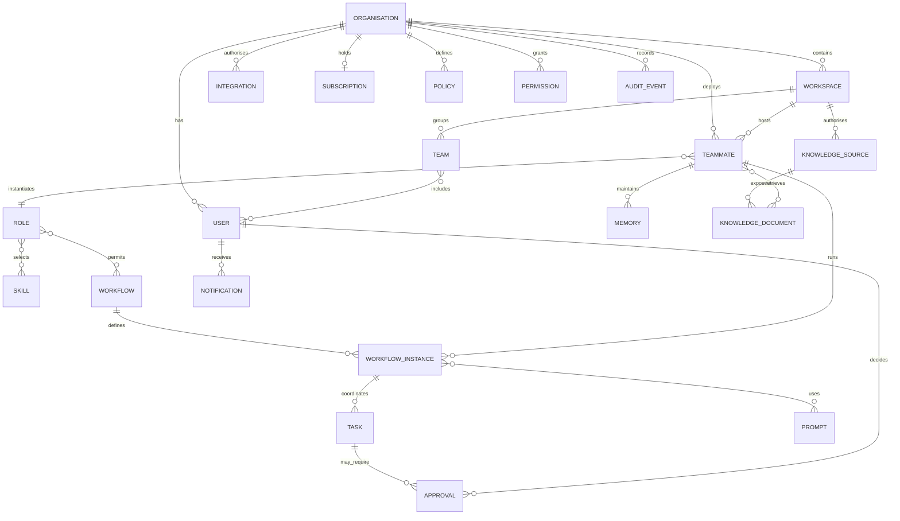

# 1. Purpose

This document defines the canonical logical domain model for the TeamMates Operating System (TMOS).

It identifies the business objects through which TMOS creates, deploys, operates and governs TeamMates. It defines their purpose, ownership, key attributes, relationships, lifecycle, tenancy scope and audit expectations.

This is a logical model. Physical tables, indexes, API payloads and provider-specific representations are defined in the related engineering specifications.

# 2. Domain Principles

1. TMOS is centred on business objects, not AI models.
2. Organisation is the primary tenant boundary.
3. TeamMate Blueprint and Role definitions are separate from deployed TeamMate instances.
4. Approvals are first-class domain objects.
5. Audit Events are append-only.
6. External business systems remain authoritative for their own source records.
7. TMOS is authoritative for TeamMate identity, work state, permissions, policy, approvals, learning and audit.
8. Every tenant-scoped object must be traceable to an Organisation.
9. Knowledge access must preserve source permissions.
10. Versioned definitions must not be silently overwritten.

# 3. Domain Object Classes

## 3.1 Platform Definitions

Platform Definitions describe reusable, versioned TMOS capability. They include:

- Role
- Skill
- Workflow
- Prompt

Released versions are immutable. A change creates a new version.

## 3.2 Tenant Configuration

Tenant Configuration applies platform capability within an Organisation. It includes:

- Workspace
- Team
- Policy
- Permission
- Integration
- Subscription

Configuration is mutable through governed change and remains traceable to its Organisation.

## 3.3 Runtime Objects

Runtime Objects represent live TeamMate operation. They include:

- TeamMate
- Workflow Instance
- Task
- Memory
- Approval
- Notification

Runtime state may change according to its defined lifecycle. Material transitions are audited.

## 3.4 Evidence and Knowledge Objects

Knowledge Source and Knowledge Document represent approved access to organisational evidence. They do not displace the authority or access controls of the originating system.

## 3.5 Identity and Accountability Objects

Organisation, User and Audit Event establish tenancy, human accountability and traceability across the model.

# 4. Entity-Relationship Overview

The diagram shows major logical relationships. It does not prescribe physical table design.

# 5. Organisation

| Aspect | Definition |
|---|---|
| Purpose | Represents a customer organisation and provides the primary TMOS tenant boundary. |
| Ownership | Customer-owned business identity; TMOS owns its platform representation and tenant controls. |
| Key attributes | Organisation identifier, name, lifecycle status, default settings, created timestamp and relevant subscription reference. |
| Relationships | Contains Workspaces, Users, Teams, TeamMates, Policies, Permissions, Integrations, Knowledge Sources, Audit Events and a Subscription. |
| Lifecycle | Created during registration; may be configured, operated, suspended or closed through governed processes. Closure does not erase records that must be retained for audit or policy reasons. |
| Tenancy scope | Tenant root. Every tenant-scoped child object must carry or derive the Organisation identifier. |
| Audit expectations | Creation, status change, material configuration change, suspension and closure are audited. |

# 6. Workspace

| Aspect | Definition |
|---|---|
| Purpose | Groups users, TeamMates, workflows, knowledge, policies and tasks within an Organisation. |
| Ownership | Customer-owned operating structure represented and governed by TMOS. |
| Key attributes | Workspace identifier, Organisation identifier, name, status, default indicator and created timestamp. |
| Relationships | Belongs to one Organisation; contains Teams, TeamMates, Knowledge Sources and tenant runtime objects. |
| Lifecycle | Created, configured, made available for work, and deactivated or archived when no longer used. The SME MVP may create one default Workspace automatically. |
| Tenancy scope | Always scoped to exactly one Organisation. |
| Audit expectations | Creation, membership or scope changes, material configuration changes and deactivation are audited. |

# 7. User

| Aspect | Definition |
|---|---|
| Purpose | Represents an authenticated human who can interact with and remain accountable for TeamMate work. |
| Ownership | The human identity belongs to the customer or identity provider; TMOS owns the platform account and its mappings. |
| Key attributes | User identifier, Organisation identifier, identity-provider reference, display name, status and relevant Workspace or Team memberships. |
| Relationships | Belongs to an Organisation; may belong to Teams and Workspaces; may request Tasks, decide Approvals, configure authorised objects and receive Notifications. |
| Lifecycle | Provisioned or registered, activated, updated, suspended and deactivated. Identity-provider state remains authoritative where applicable. |
| Tenancy scope | Scoped to one Organisation in the SME model. Any future cross-organisation administration requires explicit platform governance. |
| Audit expectations | Authentication-relevant changes, access changes, approval decisions and material actions are audited without recording unnecessary sensitive identity data. |

# 8. Team

| Aspect | Definition |
|---|---|
| Purpose | Groups Users within a Workspace for ownership, access and operational context. |
| Ownership | Customer-defined structure represented by TMOS. |
| Key attributes | Team identifier, Organisation identifier, Workspace identifier, name, status and membership references. |
| Relationships | Belongs to a Workspace and Organisation; includes Users and may provide context for TeamMates, Tasks, Knowledge or Notifications. |
| Lifecycle | Created, membership maintained, renamed or reconfigured, and archived when no longer required. |
| Tenancy scope | Scoped to one Organisation and one Workspace. |
| Audit expectations | Creation, membership change, material scope change and archival are audited. |

# 9. TeamMate

| Aspect | Definition |
|---|---|
| Purpose | Represents a deployed digital teammate operating for a customer on TMOS. |
| Ownership | The deployed instance belongs to the customer Organisation; TMOS owns and governs the runtime representation. |
| Key attributes | TeamMate identifier, Organisation identifier, Workspace identifier, selected name, Role or Blueprint version reference, DNA version, lifecycle state, suspension reason where suspended, configuration and relevant component-version references. |
| Relationships | Belongs to an Organisation and Workspace; instantiates a versioned Role or Blueprint; uses Skills, Workflows, Permissions, Policies, Knowledge and Memory; creates Workflow Instances, Tasks, Approvals, Notifications and Audit Events. |
| Lifecycle | Configuring → Probation → Active → Suspended → Archived (D-001 / F-003). There is no Draft state for a deployed TeamMate. Becoming Active never grants additional authority automatically. Customer-facing Paused is `Suspended` with `suspension_reason = customer_paused`, not a separate state. Supported reasons may also include `trial_expired`, `subscription_suspended`, `security_suspension` and `admin_suspended`. While Suspended, no new active execution or controlled external action may start; scheduled work stops where appropriate while durable workflow/task state, configuration, required audit history and retained customer data are preserved. Reactivation revalidates relevant entitlement, integrations, permissions, policy and configuration. |
| Tenancy scope | Scoped to exactly one Organisation and normally one Workspace. |
| Audit expectations | Creation, configuration, version assignment, lifecycle transitions, permission changes, controlled actions and archival are audited. |

# 10. Role

| Aspect | Definition |
|---|---|
| Purpose | Defines the type of digital teammate, including purpose, responsibilities, boundaries, outcomes, default Skills, Workflows, permissions and escalation rules. |
| Ownership | TeamMates-owned canonical platform definition, with specialist ownership and review where required. |
| Key attributes | Role key, name, description, purpose, version, status, DNA version reference, responsibilities, boundaries, success measures and escalation rules. |
| Relationships | Selects Skills and Workflows; informs permission templates, policy requirements, knowledge profiles, memory profiles and interaction defaults; is instantiated by deployed TeamMates. |
| Lifecycle | Draft → In Review → Validated → Released → Deprecated → Retired. |
| Tenancy scope | Platform-scoped definition. Customer configuration creates or modifies an instance configuration, not the canonical Role. |
| Audit expectations | Creation, review, validation, release, deprecation and every version change are audited. Released versions are not overwritten. |

# 11. Skill

| Aspect | Definition |
|---|---|
| Purpose | Defines a reusable capability that Roles and Workflows can invoke. |
| Ownership | TeamMates-owned platform definition. |
| Key attributes | Skill key, name, purpose, version, inputs, outputs, required permissions, failure behaviour, audit requirements, supported integrations and evaluation criteria. |
| Relationships | Selected by Roles; required by Workflows; executed by TeamMate runtime through authorised Integrations and governed by Policy and Permission. |
| Lifecycle | Draft, validated, released, deprecated and retired through versioned change. |
| Tenancy scope | Platform-scoped definition; runtime invocation is tenant-scoped. |
| Audit expectations | Definition and version changes are audited; meaningful tenant executions are represented through runtime and Audit Events. |

# 12. Workflow

| Aspect | Definition |
|---|---|
| Purpose | Defines a reusable, versioned coordination pattern for meaningful business work. |
| Ownership | TeamMates-owned platform definition. |
| Key attributes | Workflow key, name, version, trigger, objective, states, required Skills, required permissions, policy checks, approval points, failure behaviour, escalation, outputs and audit requirements. |
| Relationships | May be assigned to Roles; creates Workflow Instances; coordinates Tasks; uses Skills and Prompts; invokes Policy, Permission and Approval controls. |
| Lifecycle | Draft, validated, released, deprecated and retired. New behaviour is released as a new version. |
| Tenancy scope | Platform-scoped definition; each Workflow Instance is tenant-scoped. |
| Audit expectations | Definition changes and releases are audited; runtime transitions are captured against Workflow Instances. |

# 13. Workflow Instance

| Aspect | Definition |
|---|---|
| Purpose | Represents one live or completed execution of a specific Workflow version. |
| Ownership | Owned by the customer Organisation; executed and governed by TMOS. |
| Key attributes | Instance identifier, Organisation identifier, Workspace identifier, TeamMate identifier, Workflow version reference, trigger reference, current state, timestamps, outcome and correlation references. |
| Relationships | Belongs to a TeamMate and Workflow version; coordinates Tasks; may create Approvals, Notifications and Audit Events; may use Knowledge, Memory and Prompt versions. |
| Lifecycle | Created from an approved trigger, progresses only through defined states, and reaches completion, cancellation or controlled failure. |
| Tenancy scope | Scoped to one Organisation and relevant Workspace. |
| Audit expectations | Creation, material state transitions, retries, approval waits, escalation, cancellation and outcome are audited. |

# 14. Task

| Aspect | Definition |
|---|---|
| Purpose | Represents a discrete unit of work prepared, performed, monitored or completed by a TeamMate or accountable human. |
| Ownership | Owned by the customer Organisation; has a clear human or TeamMate work owner. |
| Key attributes | Task identifier, Organisation identifier, Workspace identifier, title or objective, owner, source, due date where applicable, status, priority where supplied, Workflow Instance reference and evidence references. |
| Relationships | May belong to a Workflow Instance; may be assigned to a User or TeamMate; may require Approval; may generate Notifications and Audit Events. |
| Lifecycle | Captured or created, worked, blocked or awaiting input where applicable, completed or cancelled. Customer-facing representation aligns with the approved Work Queue states. |
| Tenancy scope | Scoped to exactly one Organisation and relevant Workspace. |
| Audit expectations | Source, ownership, material status changes, reassignment, controlled completion and cancellation are audited. |

# 15. Memory

| Aspect | Definition |
|---|---|
| Purpose | Stores governed organisational, Workspace, TeamMate, working or confirmed personalisation context. |
| Ownership | Customer-owned context governed and stored by TMOS according to its category and source. |
| Key attributes | Memory identifier, Organisation identifier, category, scope reference, source, owner, confidence, sensitivity, retention, lifecycle state and confirmation status where required. |
| Relationships | May belong to an Organisation, Workspace, TeamMate or User context; may be created from approved evidence or confirmed learning; may inform Workflow Instances and Tasks. |
| Lifecycle | Proposed or captured, confirmed where required, active, superseded, expired or removed where policy permits. |
| Tenancy scope | Always scoped to one Organisation, with narrower Workspace, TeamMate or user scope where applicable. |
| Audit expectations | Material creation, confirmation, change, use in controlled decisions, expiry and removal are traceable. Memory never silently changes Policy or Permission. |

# 16. Knowledge Source

| Aspect | Definition |
|---|---|
| Purpose | Represents an authorised connection to organisational information that TMOS may search or retrieve. |
| Ownership | The source belongs to the customer or external system; TMOS owns only the connection configuration and governed index or references it creates. |
| Key attributes | Source identifier, Organisation identifier, Workspace scope, Integration reference, source type, external location reference, authorisation state, synchronisation state and access constraints. |
| Relationships | Belongs to an Organisation and optionally a Workspace; uses an Integration; exposes Knowledge Documents; may be queried by authorised TeamMates. |
| Lifecycle | Proposed, authorised, connected, synchronised, degraded, disconnected or removed. |
| Tenancy scope | Scoped to one Organisation; narrower source permissions must be preserved. |
| Audit expectations | Authorisation, connection, scope change, synchronisation failure, disconnection and material access are audited. |

# 17. Knowledge Document

| Aspect | Definition |
|---|---|
| Purpose | Represents an authorised document or retrievable knowledge item made available through a Knowledge Source. |
| Ownership | Remains owned by the customer and authoritative external system where one exists; TMOS owns only its reference, permitted derived representation and retrieval metadata. |
| Key attributes | Knowledge Document identifier, Organisation identifier, Knowledge Source identifier, external record reference, title or descriptor, source permissions, version or modification reference, classification and retrieval metadata. |
| Relationships | Belongs to a Knowledge Source; may be retrieved as evidence for TeamMates, Workflow Instances and Tasks; may contribute to Memory only through governed rules. |
| Lifecycle | Discovered or registered, available, updated or superseded in line with the source, unavailable, and removed when access is withdrawn. |
| Tenancy scope | Scoped to one Organisation and constrained by source access boundaries. |
| Audit expectations | Material retrieval and use are traceable where required; source permission changes and removal must be respected. |

# 18. Prompt

| Aspect | Definition |
|---|---|
| Purpose | Defines a versioned reasoning implementation asset used within the protected instruction hierarchy. |
| Ownership | TeamMates-owned managed platform asset unless explicitly designated as governed customer configuration. |
| Key attributes | Prompt identifier, purpose, version, owner, expected inputs, structured output expectation, evaluation suite reference and release status. |
| Relationships | May support a Role, Skill or Workflow; used by Workflow Instances through AI orchestration; remains subordinate to DNA, Policy and Permission. |
| Lifecycle | Draft, evaluated, released, deprecated and retired. Released versions are immutable. |
| Tenancy scope | Normally platform-scoped definition; assembled runtime context is tenant-scoped and must not be reused across tenants. |
| Audit expectations | Version creation, evaluation, release and runtime version selection are traceable for meaningful work. Sensitive prompt content need not be exposed to customers. |

# 19. Policy

| Aspect | Definition |
|---|---|
| Purpose | Expresses a rule governing whether an action is allowed in a particular platform or organisational context. |
| Ownership | May be protected TeamMates platform policy or customer Organisation policy; ownership and precedence are explicit. |
| Key attributes | Policy identifier, Organisation identifier where tenant-defined, policy type, scope, rule, status, effective period, owner, version and precedence context. |
| Relationships | Applies to Roles, TeamMates, Workflows, Skills, resources and actions; evaluated independently of AI reasoning; may require or prohibit Approval. |
| Lifecycle | Draft, reviewed, active, superseded, expired or retired. Protected policies cannot be weakened by tenant configuration. |
| Tenancy scope | Platform-scoped or scoped to exactly one Organisation; optional narrower Workspace or resource scope may apply. |
| Audit expectations | Creation, activation, change, supersession and every material decision outcome are audited. |

# 20. Permission

| Aspect | Definition |
|---|---|
| Purpose | Represents explicit authority for an actor or TeamMate to perform an action against a defined resource and scope. |
| Ownership | Granted by an authorised customer or protected platform process; enforced by TMOS. |
| Key attributes | Permission identifier, Organisation identifier, subject, action, resource, scope, owner, approval requirement, status, grant source and expiry where relevant. |
| Relationships | Applies to Users or TeamMates; constrains Skills, Workflows and Integrations; is re-evaluated with Policy before controlled external execution. |
| Lifecycle | Requested or configured, granted, active, reduced, revoked or expired. Absence of permission means denial. |
| Tenancy scope | Scoped to exactly one Organisation and must never enable cross-tenant access. |
| Audit expectations | Grant, reduction, revocation, expiry and material allow or deny decisions are audited. |

# 21. Approval

| Aspect | Definition |
|---|---|
| Purpose | Represents a specific human decision about a clearly presented proposed action. |
| Ownership | Owned by the customer Organisation and assigned to an accountable authorised User. |
| Key attributes | Approval identifier, Organisation identifier, requester, decision owner, proposed action, rationale, evidence, assumptions, impact, uncertainty, status, decision and timestamps. |
| Relationships | May belong to a Task or Workflow Instance; requested by a TeamMate or User; decided by an authorised User; links to relevant Policy, Permission, external action and Audit Events. |
| Lifecycle | Created, pending, approved, rejected, expired or cancelled. Approval applies only to the action presented. |
| Tenancy scope | Scoped to exactly one Organisation and relevant Workspace. |
| Audit expectations | Creation, presentation, decision, decision maker, material content, expiry, cancellation and any resulting execution are audited. |

# 22. Audit Event

| Aspect | Definition |
|---|---|
| Purpose | Provides an append-only record of a meaningful platform, user or TeamMate event so work can be reconstructed. |
| Ownership | TMOS-owned integrity record held for the customer Organisation under applicable governance. |
| Key attributes | Event identifier, Organisation identifier, actor, TeamMate, action, reason, evidence references, Policy decision, Permission decision, Approval reference, outcome, relevant component versions and timestamp. |
| Relationships | May reference any audited domain object and correlate events across a Workflow Instance, Task or external action. |
| Lifecycle | Appended once and retained according to policy. Corrections occur through additional events, not silent mutation. |
| Tenancy scope | Scoped to exactly one Organisation, except explicitly identified platform operational events that contain no tenant data. |
| Audit expectations | The object is the audit record. It must be tamper-resistant, append-only and queryable through authorised governance paths. |

# 23. Integration

| Aspect | Definition |
|---|---|
| Purpose | Represents an authorised connection between TMOS and an external provider or customer system. |
| Ownership | The customer owns the external account and grants access; TMOS owns the connector configuration and secure credential reference. |
| Key attributes | Integration identifier, Organisation identifier, provider, capability set, connection status, granted scopes, credential or secret reference, owner, health state and timestamps. |
| Relationships | Used by Skills and Workflows; connects Knowledge Sources and external actions; governed by Permission, Policy and audit. |
| Lifecycle | Proposed, authorised, connected, healthy or degraded, disconnected and removed. |
| Tenancy scope | Scoped to exactly one Organisation and, where configured, a narrower Workspace or user context. |
| Audit expectations | Connection, consent or scope change, credential-relevant change, failure, reconnection and disconnection are audited without exposing secrets. |

# 24. Notification

| Aspect | Definition |
|---|---|
| Purpose | Represents information delivered or queued for a User through an approved experience surface. |
| Ownership | Owned by the customer Organisation; generated and delivered by TMOS. |
| Key attributes | Notification identifier, Organisation identifier, recipient, type or communication mode, source object, priority or urgency where applicable, channel, status and timestamps. |
| Relationships | May originate from a TeamMate, Workflow Instance, Task, Approval, Integration or security event; is delivered to a User through an experience channel. |
| Lifecycle | Created, queued, delivered, read or dismissed where supported, failed or expired. |
| Tenancy scope | Scoped to exactly one Organisation and recipient. |
| Audit expectations | Time-sensitive approval, significant failure and critical integration or security notifications require delivery traceability; routine activity need not create excessive audit noise. |

# 25. Subscription

| Aspect | Definition |
|---|---|
| Purpose | Represents the Organisation's commercial entitlement to use TeamMates. |
| Ownership | Customer-owned commercial relationship represented by TMOS and linked to the approved billing provider. |
| Key attributes | Subscription identifier, Organisation identifier, plan or entitlement reference, billing-provider reference, status, effective period and relevant trial or renewal timestamps. |
| Relationships | Belongs to an Organisation; may govern permitted deployment or continued use without changing TeamMate role, DNA, Policy or Permission rules. |
| Lifecycle | Trial or pending where applicable, active, changed, cancelled or ended according to the commercial process and billing-provider state. |
| Tenancy scope | Scoped to exactly one Organisation. |
| Audit expectations | Creation, activation, material entitlement change, cancellation and billing-provider reconciliation events are audited without storing unnecessary payment data. |

# 26. Object Lifecycle Standards

All TMOS objects follow these standards:

1. Lifecycle state must be explicit where state affects behaviour.
2. State transitions must be validated by the owning domain rule.
3. Material transitions must identify actor, reason and timestamp.
4. Deactivation or archival is preferred where deletion would break traceability.
5. Retention and removal follow applicable Policy and source-system obligations.
6. Runtime state must not change a versioned definition.
7. Failure, cancellation and expiry are represented explicitly where relevant.
8. Lifecycle transition names may differ by object, but their meaning must remain consistent and documented.

# 27. Relationship Model

Relationships must:

- use stable object identifiers
- preserve the Organisation boundary
- identify the owning side and dependency direction
- avoid copying external records merely to create a relationship
- retain relevant version references for reconstructability
- distinguish canonical definitions from runtime instances
- support traceability from customer work back to TeamMate, Role or Blueprint, Workflow, Skills, Prompt, Permission, Policy, Approval and evidence where applicable

A relationship does not itself grant access. Permission and Policy remain independently enforced.

# 28. System-of-Record Boundaries

External systems remain authoritative for their native records.

Examples:

- Outlook is authoritative for email.
- Microsoft Calendar is authoritative for calendar events.
- SharePoint or OneDrive is authoritative for source documents.
- The configured identity provider is authoritative for its identity assertions.
- The billing provider is authoritative for its payment processing records.

TMOS may retain identifiers, metadata, approved derived representations, work state and audit references needed to perform governed TeamMate work.

TMOS must not treat a cached or derived record as more authoritative than its source.

# 29. TMOS Authority

TMOS is authoritative for:

- TeamMate identity
- TeamMate lifecycle and configuration
- Role or Blueprint assignment
- Workflow and Task state
- Permissions
- Policies
- Approvals
- governed Memory and confirmed learning
- Audit Events
- platform component-version references
- TMOS Integration configuration
- TMOS Notifications

External execution remains subject to confirmation from the external system before completion is recorded.

# 30. Platform-Owned and Customer-Owned Definitions

| Category | Platform-owned | Customer-owned |
|---|---|---|
| Canonical behaviour | TeamMate DNA, Role or Blueprint definitions, Skills, Workflows, managed Prompts and protected Policies | Approved organisational context and permitted configuration |
| Identity | TMOS runtime identity and identifiers | Organisation identity, human users and authorised external accounts |
| Configuration | Protected platform defaults and restrictions | Workspace, Team, selected knowledge, preferences and reduced permission scope |
| Data and evidence | Governed references, derived work state and audit | Business records and source-system content |
| Decisions | Enforcement and traceability mechanisms | Human approvals and accountable business decisions |
| Commercial | Subscription representation and entitlement enforcement | Customer commercial relationship and selected plan |

Customer configuration may personalise or reduce access. It may not override protected DNA, platform security, mandatory audit or Role restrictions.

# 31. Versioned and Runtime Objects

## 31.1 Versioned Definitions

The following are versioned definitions:

- TeamMate DNA
- Role or TeamMate Blueprint
- Skill
- Workflow
- Prompt
- versioned Policy where applicable

A deployed TeamMate records the exact definition and component versions under which it operates.

## 31.2 Runtime Objects

The following represent live customer operation:

- TeamMate
- Workflow Instance
- Task
- Memory
- Knowledge Source
- Knowledge Document reference
- Permission grant
- Approval
- Audit Event
- Integration
- Notification
- Subscription

Runtime objects reference versioned definitions rather than modifying them.

# 32. Immutable and Mutable Records

## 32.1 Immutable or Append-Only

- Audit Events are append-only.
- Released Role or Blueprint, Skill, Workflow and Prompt versions are immutable.
- Recorded Approval decisions must not be silently rewritten.
- Historical component-version references used for completed meaningful work must remain reconstructable.

## 32.2 Governed Mutable

- Organisation, Workspace, User and Team configuration
- deployed TeamMate runtime state
- Workflow Instance and Task state
- active Memory subject to governance
- Knowledge Source connection state
- Policy activation state through versioned or traceable change
- Permission status
- Integration health and status
- Notification delivery state
- Subscription state

Every material mutation is validated, tenancy-scoped and audited.

# 33. Multi-Tenancy Rules

1. Organisation is the primary tenant boundary.
2. Every tenant-scoped object carries or unambiguously derives an Organisation identifier.
3. Cross-tenant access is prohibited.
4. Application and data layers both enforce the tenant boundary.
5. Relationships across Organisations are invalid unless an explicitly governed future platform capability defines otherwise.
6. Queries and events must establish Organisation context before accessing tenant data.
7. Background work, queues and integrations preserve Organisation context.
8. Knowledge retrieval preserves both Organisation and source permissions.
9. Memory and AI context must not be shared across Organisations.
10. Audit access is tenant-scoped and authorised.
11. Platform definitions may be shared, but tenant configuration and runtime state remain isolated.
12. External provider identifiers do not replace the TMOS Organisation boundary.

# 34. Knowledge Permission Preservation

Knowledge access is the intersection of:

- Organisation boundary
- Workspace or narrower scope
- User and TeamMate permissions
- source-system permissions
- applicable Policy
- Integration authorisation

Indexing, caching, embeddings or derived representations must not widen access.

When source access is withdrawn, TMOS must stop presenting the affected content and apply the relevant retention and audit policy.

# 35. Extension Principles

The domain model may be extended when approved product or architecture requirements justify it.

Extensions must:

1. Reuse existing objects before introducing new ones.
2. Remain centred on business concepts rather than model-provider concepts.
3. Preserve Organisation traceability.
4. Preserve Role or Blueprint and instance separation.
5. Preserve Policy, Permission, Approval and Audit boundaries.
6. Preserve source-system authority.
7. Define ownership, lifecycle, tenancy and audit expectations.
8. Distinguish definition objects from runtime objects.
9. Version reusable definitions.
10. Avoid provider-specific concepts in the core domain unless isolated behind Integration boundaries.
11. Remain compatible with the modular-monolith MVP unless separation is justified.
12. Avoid introducing future marketplace, multi-TeamMate or enterprise capability before it is approved.

# 36. Domain Integrity Rules

- A TeamMate cannot exist without an Organisation, Workspace and released Role or Blueprint reference.
- A Workflow Instance cannot exist without a Workflow version and tenant context.
- A Task must have an Organisation and traceable source.
- A Permission cannot grant authority outside its Organisation or protected platform limits.
- An Approval cannot authorise more than the proposed action.
- A Policy decision is independent of AI confidence or recommendation.
- A Knowledge Document cannot be used beyond its Knowledge Source and source permission boundaries.
- Memory cannot expand Permission or weaken Policy.
- A Notification cannot disclose content beyond the recipient's authorised access.
- Completion of an external action requires confirmation from the authoritative external system.
- Audit Events cannot be silently altered or deleted through ordinary domain operations.
- Released versioned definitions cannot be silently overwritten.

# 37. Related Documents

- [TeamMates Product Requirements Document](../strategy/product-requirements.md)
- [TMOS Platform Architecture](tmos-platform-architecture.md)
- [TeamMate DNA](teammate-dna.md)
- [TeamMate Factory](teammate-factory.md)
- [TeamMate Interaction Model](teammate-interaction-model.md)
- [TMOS System Architecture](tmos-system-architecture.md)
- [Data Model and Database Schema](../engineering/data-model-database-schema.md)
- [API Contract and Service Interfaces](../engineering/api-contract-service-interfaces.md)
