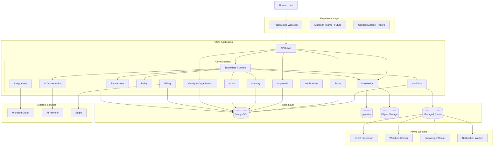
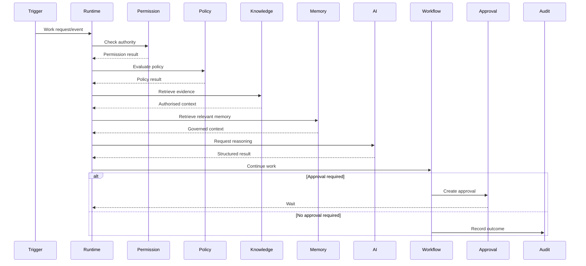
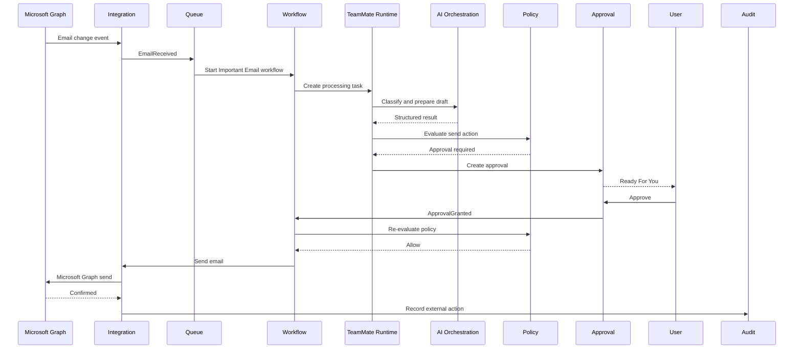
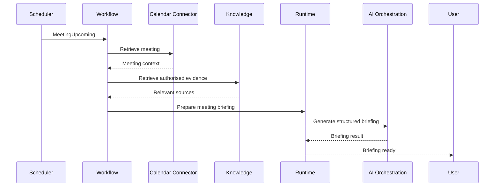

# 1. Purpose

This document defines the physical and software architecture for the TeamMates Operating System (TMOS) SME MVP.

It translates the logical TMOS Platform Architecture into an implementation model covering:

- frontend
- backend
- runtime
- asynchronous processing
- data
- AI orchestration
- integrations
- authentication
- security
- observability
- deployment
- scalability

The architecture must support the Admin TeamMate MVP while preserving clear evolution paths for future TeamMate roles.

# 2. Architecture Strategy

TMOS should be designed as a platform but implemented pragmatically for the MVP.

The initial architecture shall use:

- modular monolith backend
- asynchronous background workers
- event-driven workflow execution
- PostgreSQL
- pgvector
- managed object storage
- managed queue infrastructure
- Microsoft 365 integration
- AI provider abstraction
- API-first frontend/backend interaction

Do not implement a distributed microservices architecture merely to reflect logical service boundaries.

# 3. Core Architectural Rule

Logical separation does not require physical separation.

TMOS should maintain explicit modules for:

- Identity
- Organisation
- TeamMate Runtime
- Roles
- Skills
- Workflows
- Tasks
- Permissions
- Policies
- Approvals
- Memory
- Knowledge
- AI
- Integrations
- Notifications
- Audit
- Billing

These may initially execute within a shared backend deployment.

Module boundaries must nevertheless be explicit enough to support later extraction where justified.

# 4. High-Level System Architecture



# 5. Frontend Architecture

The MVP frontend should be a responsive web application.

Recommended technology:

- Next.js
- React
- TypeScript

Primary customer surfaces:

- onboarding
- Today
- Work Queue
- Ask TeamMate
- approvals
- meeting brief
- knowledge
- TeamMate profile
- permissions
- probation
- trust/governance
- settings

The frontend must not contain authoritative permission or policy logic.

# 6. Backend Architecture

Recommended MVP backend:

- TypeScript
- Node.js
- API-first modular application

The backend is responsible for:

- tenant resolution
- authentication integration
- domain logic
- permissions
- policies
- workflows
- runtime execution
- integration orchestration
- persistence
- audit

The backend remains authoritative for controlled business actions.

# 7. Modular Monolith Structure

Conceptual structure:

```text
apps/
  web/
  api/

packages/
  domain/
  identity/
  organisations/
  teammates/
  tasks/
  workflows/
  permissions/
  policies/
  approvals/
  memory/
  knowledge/
  ai/
  integrations/
  notifications/
  audit/
  billing/
  ui/

workers/
  events/
  workflows/
  knowledge/
  notifications/
```

Exact code structure may evolve.

Module ownership and dependencies should remain explicit.

# 8. Dependency Direction

Domain logic should not depend directly on:

- Microsoft Graph
- OpenAI
- Stripe
- frontend frameworks

External systems should be accessed through adapters.

Conceptually:

Domain

← Application Services

← Interfaces

← Provider Adapters

This supports testability and provider replacement.

# 9. API Layer

All customer-facing application access enters through a versioned API.

Recommended base:

`/api/v1`

API responsibilities include:

- authentication validation
- tenant resolution
- input validation
- authorisation
- routing
- consistent errors
- request correlation
- audit hooks

# 10. Authentication

Initial identity provider:

Microsoft identity / Entra-compatible OAuth.

The architecture should support future:

- Google
- enterprise SSO
- service identities

Authentication answers:

> Who are you?

Authorisation separately answers:

> What are you allowed to do?

# 11. Tenant Resolution

Every authenticated request must resolve organisation context server-side.

The client must not establish tenant authority simply by supplying:

`organisation_id`

Tenant enforcement should exist through:

- authenticated membership
- application service checks
- PostgreSQL Row Level Security where appropriate

# 12. TeamMate Runtime

The TeamMate Runtime is the primary orchestration component for role behaviour.

It coordinates:

1. TeamMate identity
2. DNA version
3. Role
4. Current task
5. Workflow
6. Permissions
7. Policies
8. Memory
9. Knowledge
10. AI reasoning
11. Skills
12. Approvals
13. External actions
14. Audit

The Runtime does not own all these capabilities.

It orchestrates them.

## 12.1 Lifecycle Enforcement

The deployed TeamMate lifecycle is exactly `configuring → probation → active → suspended → archived` (D-001 / F-003). A deployed TeamMate has no `draft` state.

Lifecycle enforcement is deterministic application logic. Before any active execution starts, and again before any controlled external action, the Runtime must confirm that the TeamMate is `active`. A `suspended` TeamMate cannot start new active execution or perform a new controlled external action.

Customer-facing Paused is represented by `status = suspended` and `suspension_reason = customer_paused`. Other supported reasons may include `trial_expired`, `subscription_suspended`, `security_suspension` and `admin_suspended`.

Suspension preserves durable workflow/task state, configuration, required audit history and customer data subject to retention rules. Reactivation must revalidate relevant subscription or entitlement, integrations, permissions, policy and TeamMate configuration before changing the TeamMate to `active`.

# 13. Runtime Execution Model

Conceptually:



# 14. Skills

Skills represent reusable capabilities.

A Skill should expose a defined interface.

Example:

```text
Skill: email.draft

Input:
- thread
- objective
- evidence
- communication preferences

Output:
- subject
- body
- assumptions
- confidence
```

Skills must not silently execute beyond their defined authority.

# 15. Workflow Engine

The Workflow module coordinates long-running work.

It supports:

- state transitions
- asynchronous waits
- approvals
- retries
- timeouts
- cancellation
- Needs Input
- external events
- completion

Workflow state must survive application restarts.

# 16. Event Architecture

TMOS should publish domain events for significant state changes.

Examples:

- TeamMateHired
- TeamMateProbationStarted
- EmailReceived
- TaskCreated
- ApprovalRequested
- ApprovalGranted
- ApprovalRejected
- WorkflowCompleted
- IntegrationDisconnected
- KnowledgeUpdated

Events support loose coupling and asynchronous behaviour.

# 17. Event Envelope

Standard event shape should contain:

- event_id
- event_type
- event_version
- organisation_id
- workspace_id where applicable
- actor
- occurred_at
- correlation_id
- causation_id
- payload

# 18. Transactional Outbox

Use a transactional outbox pattern for domain events that must remain consistent with database state.

Business transaction:

↓

Write domain state

+

Write outbox event

↓

Commit

↓

Worker publishes event

This prevents committed work from losing its associated event because of a queue failure.

# 19. Managed Queue

Use managed queue infrastructure for MVP asynchronous processing.

Use cases:

- email processing
- workflow continuation
- briefing generation
- knowledge indexing
- notification delivery
- retry handling

Do not introduce Kafka unless scale or event-streaming requirements justify it.

# 20. Background Workers

Initial worker categories:

## Event Worker

Processes integration and domain events.

## Workflow Worker

Executes asynchronous workflow stages.

## Knowledge Worker

Processes document ingestion and indexing.

## Notification Worker

Delivers customer notifications.

Workers should be horizontally scalable independently from the API where needed.

# 21. Task Model

Tasks represent units of meaningful work.

Tasks may originate from:

- user delegation
- workflow
- external event
- scheduled event

Tasks should persist independently of chat sessions.

# 22. Approval Architecture

Approvals are persisted domain objects.

A workflow requiring approval:

1. prepares proposed action
2. creates Approval
3. enters waiting state
4. surfaces approval to user
5. receives decision
6. re-evaluates permission
7. re-evaluates policy
8. executes if still authorised
9. records outcome

Approval is not equivalent to permanent permission.

# 23. Policy Engine

Policy evaluation is deterministic where practical.

Inputs may include:

- actor
- TeamMate
- action
- resource
- organisation
- workspace
- permission
- risk classification
- workflow context

Output:

- allow
- deny
- approval_required
- escalate

AI should not be the authoritative policy engine.

# 24. Permission Engine

Permissions should support:

- explicit grants
- explicit denies
- resource scope
- action scope
- approval requirement
- expiry

Explicit deny should take precedence.

No permission should be inferred solely from the AI's understanding of the user's intent.

# 25. Knowledge Architecture

Knowledge processing pipeline:


# 26. Knowledge Storage

For MVP:

- metadata in PostgreSQL
- embeddings in pgvector
- uploaded/source file artefacts in managed object storage where required

Avoid introducing a dedicated vector database until demonstrated scale requires it.

# 27. Knowledge Security

Indexed content must retain sufficient metadata to enforce:

- organisation
- workspace
- source
- document
- classification
- user/TeamMate access

Embedding a document must never remove its access-control context.

# 28. Memory Architecture

Memory is persisted through the TMOS Memory module.

Memory types include:

- organisation
- workspace
- TeamMate
- working
- personalisation

Memory retrieval should be scoped to the current:

- tenant
- TeamMate
- task
- user where appropriate

# 29. Memory vs Knowledge

Knowledge represents customer-authorised source information.

Memory represents governed context retained by TMOS.

They should not be conflated.

Example:

Company policy document:

Knowledge.

Confirmed preference:

> Use "Thanks" as my default sign-off.

Memory.

# 30. AI Orchestration Layer

The AI module provides a provider-independent reasoning interface.

Responsibilities:

- prompt assembly
- context packaging
- model selection
- structured-output enforcement
- tool/Skill requests
- retries
- validation
- usage metadata
- model abstraction

# 31. Structured Outputs

Where possible, AI output used by workflows should be structured rather than free-form.

Example:

```json
{
  "classification": "important",
  "response_required": true,
  "reason": "Customer requested confirmation",
  "confidence": "high"
}
```

This improves:

- validation
- workflow control
- testing
- auditability

# 32. AI Provider Adapter

Conceptual interface:

```text
ReasoningProvider

execute(request)

returns

ReasoningResult
```

Provider-specific implementations may include:

- OpenAI
- Azure OpenAI
- future providers

The Runtime should not depend directly on provider-specific APIs.

# 33. Model Routing

Future model routing may consider:

- task type
- quality
- latency
- cost
- customer requirements
- geography
- compliance

MVP may use a simpler single-provider strategy behind the same abstraction.

# 34. Prompt Management

Prompts should be:

- versioned
- repository controlled
- associated with purpose
- tested
- traceable to AI runs

Avoid hard-coding unmanaged prompts throughout application logic.

# 35. Microsoft Integration

Microsoft Graph is the first major productivity connector.

Initial capabilities:

- email read
- email thread retrieval
- email send after approval
- calendar read
- selected calendar modification
- SharePoint retrieval
- OneDrive retrieval

Use minimum required OAuth scopes.

# 36. Integration Adapter

Internal TMOS code should invoke provider-neutral operations.

Example:

```text
MailConnector.getMessage()
MailConnector.getThread()
MailConnector.sendMessage()

CalendarConnector.listEvents()
CalendarConnector.getEvent()

FileConnector.search()
FileConnector.get()
```

Microsoft Graph implements these interfaces.

# 37. Webhooks and Change Events

Where Microsoft supports reliable change notifications, prefer event-driven integration rather than continuous polling.

Webhook processing must:

- authenticate source
- deduplicate events
- persist event
- return promptly
- process asynchronously

# 38. Integration Idempotency

External events must include or derive stable identifiers.

TMOS should prevent duplicate provider events from causing duplicate:

- tasks
- approvals
- emails
- workflow executions

# 39. External Action Idempotency

High-consequence external execution should use idempotency protection.

Examples:

- send email
- create meeting
- start workflow
- billing operation

A retry must not create duplicate external effects.

# 40. Data Layer

PostgreSQL is the primary database.

It stores:

- organisations
- users
- workspaces
- TeamMates
- roles
- skills
- workflows
- tasks
- approvals
- policies
- permissions
- memory
- knowledge metadata
- integrations
- audit
- subscriptions

# 41. PostgreSQL Extensions

MVP may use:

`pgvector`

for semantic retrieval.

Additional extensions should only be introduced where justified.

# 42. Object Storage

Managed object storage may contain:

- customer uploads
- extracted artefacts where required
- temporary processing objects

Access should use scoped server-side controls or short-lived signed access.

Objects must remain tenant-associated.

# 43. Cache

Redis or equivalent may be introduced for:

- ephemeral cache
- distributed locks where necessary
- rate limiting
- short-lived runtime state

Do not use cache as the authoritative store for workflow state.

The MVP should avoid introducing Redis unless there is a concrete need.

# 44. Audit Store

For MVP, audit may initially reside in PostgreSQL using append-only application controls and appropriate database restrictions.

Future enterprise scale may justify a dedicated immutable audit store.

The logical boundary should remain explicit.

# 45. Audit Event Requirements

Capture where relevant:

- organisation
- actor
- TeamMate
- workflow
- task
- action
- evidence references
- permission decision
- policy decision
- approval
- component versions
- outcome
- timestamp

# 46. Secrets

Never store raw provider secrets in ordinary application tables.

Use managed secret storage for:

- application secrets
- encryption keys
- provider credentials

Customer OAuth credentials/tokens should be stored using an appropriately protected token/secret mechanism.

Database records should preferably reference protected credential material.

# 47. Encryption

Required:

- TLS in transit
- encryption at rest
- protected secret storage

Sensitive application data should receive additional protection where risk assessment requires it.

# 48. Row Level Security

Tenant-scoped PostgreSQL tables should use Row Level Security where practical as defence in depth.

RLS supplements rather than replaces application authorisation.

# 49. Logging

Logs should contain:

- request identifiers
- correlation identifiers
- service/module
- severity
- error classification
- timing

Avoid unnecessary inclusion of:

- email bodies
- documents
- credentials
- unrestricted prompt content
- sensitive personal data

# 50. Observability

The MVP should expose:

- request rate
- error rate
- latency
- workflow success/failure
- queue depth
- worker failures
- Microsoft integration health
- AI provider health
- AI latency
- AI usage/cost
- knowledge indexing health
- approval execution failure

# 51. Correlation

Every significant business journey should use a correlation identifier.

Example:

EmailReceived

↓

TaskCreated

↓

DraftPrepared

↓

ApprovalRequested

↓

ApprovalGranted

↓

EmailSent

All should be traceable as one business flow.

# 52. Error Classification

Standard operational categories:

- validation
- authentication
- authorisation
- policy denial
- integration transient
- integration permanent
- AI transient
- AI invalid output
- knowledge unavailable
- workflow failure
- infrastructure failure

This supports appropriate retry and alert behaviour.

# 53. Retry Strategy

Automatically retry transient failures.

Use:

- bounded retries
- exponential backoff
- jitter where appropriate

Do not automatically retry:

- permission denial
- policy denial
- invalid customer instruction
- missing mandatory human approval
- permanent authentication failure
- deterministic validation failure

Retries must preserve idempotency.

A retry must never create duplicate external business effects.

# 54. Failure Handling

Failures should be classified according to whether they are:

## Recoverable Automatically

Examples:

- temporary AI provider timeout
- temporary Microsoft Graph timeout
- transient queue failure

The system may retry without customer intervention.

## Recoverable With Customer Action

Examples:

- Microsoft consent revoked
- required information missing
- approval expired
- required permission not granted

The workflow should enter an appropriate waiting or Needs Your Input state.

## Non-Recoverable

Examples:

- policy prohibits action
- role does not permit action
- requested capability is unavailable

The workflow should stop safely and explain why.

# 55. Safe Failure Principle

When a dependency fails, TMOS should prefer:

- incomplete but clearly labelled work
- paused work
- escalation
- explicit failure

over misleading or unsafe completion.

Example:

If SharePoint is unavailable during meeting preparation, TMOS may still prepare a partial briefing using authorised email and calendar information, but it must identify that document evidence was unavailable.

# 56. Workflow Persistence

Workflow state must persist independently of:

- individual API process
- worker process
- browser session
- AI provider request

A worker crash or application restart must not cause business work to disappear.

# 57. Workflow Concurrency

TMOS should protect controlled resources against conflicting concurrent execution.

Techniques may include:

- optimistic concurrency
- object version checks
- idempotency keys
- resource locks where justified

Example:

Two workflows should not independently modify the same calendar event using stale state.

# 58. Scheduled Work

Scheduled behaviour includes:

- Morning Briefing
- overdue action checks
- integration health checks
- approval expiry
- knowledge refresh

Scheduled jobs should create the same traceable workflow/event structures as other triggers.

Scheduled execution must not bypass ordinary permission or policy controls.

The scheduler must not start TeamMate active work while the TeamMate is `suspended`. It may continue only platform maintenance required for security, retention, audit or reactivation validation; such work must not perform a controlled external action on behalf of the suspended TeamMate.

# 59. Notification Architecture

The Notification module receives domain events and determines appropriate delivery.

Potential delivery channels:

- in-product
- email
- Microsoft Teams
- future push
- future Slack

Notification delivery is asynchronous.

The workflow itself should not need provider-specific notification logic.

# 60. Notification Priority

Notification priority should distinguish:

- critical
- action required
- informational
- background

Routine TeamMate activity should generally remain within the Work Queue or Daily Briefing instead of creating immediate notifications.

# 61. Billing Architecture

Stripe is the initial billing provider.

TMOS owns:

- product entitlement
- TeamMate entitlement
- subscription state interpretation

Stripe owns:

- payment processing
- payment method
- billing transaction records

Webhook events must be:

- authenticated
- idempotent
- processed asynchronously where appropriate
- audited

# 62. Subscription Enforcement

Commercial entitlement should be enforced server-side.

Examples:

A suspended or expired subscription may prevent:

- starting new TeamMate work
- deploying additional TeamMates

It should not prevent necessary customer access to:

- billing
- data controls
- integrations
- appropriate exports
- account management

# 63. Frontend State Management

The frontend should treat backend APIs and workflow state as authoritative.

Do not maintain independent business workflow truth solely inside client state.

Frontend state is appropriate for:

- view state
- local forms
- optimistic presentation where safe

Persistent work state belongs to TMOS.

# 64. Real-Time Updates

The application may use:

- server-sent events
- WebSockets
- managed real-time database capabilities
- efficient polling

for Work Queue and workflow updates.

The implementation should favour simplicity for MVP.

Real-time transport is a presentation concern and must not become the workflow system of record.

# 65. File Processing

Uploaded or retrieved documents should pass through controlled processing.

Conceptually:

Upload / Retrieve

↓

Validate File

↓

Malware/Security Controls where required

↓

Extract Content

↓

Classify

↓

Store Metadata

↓

Chunk

↓

Embed

↓

Index

Processing failures must not make partially indexed documents appear fully available.

# 66. Supported File Types

Initial file support should focus on common SME business formats where reliable extraction is available.

Examples may include:

- PDF
- DOCX
- TXT

Additional formats should be added based on demonstrated customer demand.

File support should not become an uncontrolled MVP scope-expansion area.

# 67. Data Retention

Retention is governed by:

- platform defaults
- organisation policy
- data type
- regulatory requirement
- customer request

Temporary runtime data should not automatically receive indefinite retention.

Memory, audit and customer source data have distinct retention requirements.

# 68. Data Deletion

Deletion behaviour should distinguish:

- external source disconnection
- TMOS-derived index deletion
- personalisation deletion
- account deletion
- audit retention obligations

Disconnecting a source should prevent new access immediately and trigger appropriate cleanup of derived retrievable content.

# 69. Security Boundaries

Important trust boundaries include:

```text
Internet
   ↓
Web Application / API Boundary
   ↓
TMOS Application Boundary
   ↓
Worker Boundary
   ↓
Customer Integration Boundary
   ↓
External Provider Boundary
```

Each boundary should use:

- authenticated communication
- validation
- least privilege
- explicit trust assumptions

# 70. AI Trust Boundary

AI model output is untrusted until validated.

The AI provider may suggest:

- classification
- draft content
- extracted actions
- recommended workflow decisions

TMOS remains responsible for deciding whether that output can affect business state.

# 71. Tool Invocation

AI models should not receive unrestricted direct access to external business systems.

Preferred pattern:

AI proposes structured Skill/tool invocation.

↓

TMOS validates request.

↓

Permission evaluation.

↓

Policy evaluation.

↓

Skill executes if authorised.

↓

Result returns to Runtime.

This prevents reasoning capability from becoming execution authority.

# 72. Prompt Injection Defence

Inputs originating from:

- email
- documents
- meeting transcripts
- websites
- integrations

must be treated as untrusted content.

Controls should include:

- strict instruction hierarchy
- structured tool boundaries
- permission enforcement outside the model
- policy enforcement outside the model
- output validation
- security evaluation datasets

Prompt injection defence must not depend solely on telling the model to ignore malicious instructions.

# 73. Model Failure

Possible AI failures include:

- timeout
- provider outage
- malformed output
- unsupported claim
- refusal
- inappropriate tool request

TMOS should handle these as application failure states rather than assuming every model response is usable.

# 74. AI Output Validation

Depending on workflow, validation may include:

- schema validation
- required-field checks
- evidence checks
- policy checks
- permitted-action checks
- confidence rules
- prohibited-content checks

Invalid AI output should not automatically advance the workflow.

# 75. Reasoning Traceability

TMOS should record enough structured information to explain operational behaviour without storing or exposing hidden model chain-of-thought.

Relevant traceability includes:

- task objective
- sources used
- model
- prompt version
- structured result
- confidence
- resulting action
- policy and approval decisions

Do not expose private model reasoning as the explanation mechanism.

# 76. Development Environments

Required environments:

- local
- development
- staging
- production

Production must use separate:

- credentials
- databases
- storage
- integration configuration
- secrets

Customer production information should not automatically flow into non-production environments.

# 77. Infrastructure as Code

Infrastructure configuration should be version controlled where practical.

Infrastructure-as-code should eventually cover:

- application hosting
- database
- storage
- queues
- networking
- secret resources
- monitoring

The exact cloud technology may evolve.

# 78. Deployment Strategy

The MVP should support repeatable automated deployment.

Recommended:

Source Control

↓

CI

↓

Automated Test

↓

Build

↓

Staging Deployment

↓

Release Validation

↓

Production Deployment

Production deployment should not depend on manual server modification.

# 79. Continuous Integration

CI should execute at minimum:

- linting
- type checking
- unit tests
- API tests
- database/migration checks
- security/dependency checks

Changes affecting AI behaviour should trigger relevant AI evaluation suites.

# 80. Feature Flags

Significant workflows and AI behaviour should support controlled rollout where practical.

Examples:

- Meeting Preparation
- Learning
- new email-classification version
- new prompt version

Feature flags support:

- pilot cohorts
- staged rollout
- rollback
- customer-specific debugging

# 81. Deployment Rollback

Application releases must support rollback.

AI-related assets should also support independent rollback where practical:

- prompts
- workflow definitions
- role definitions
- Skill versions

AI behaviour changes should not require a full application rollback when a configuration rollback is sufficient.

# 82. Initial Hosting Strategy

The MVP should favour managed services.

Selection criteria:

- security
- operational simplicity
- UK/EU deployment capability
- PostgreSQL support
- managed queues
- object storage
- monitoring
- cost efficiency

Avoid selecting infrastructure primarily to optimise theoretical hyperscale requirements before product-market fit.

# 83. Containers

Containerisation may be used for:

- API
- workers
- supporting services

Kubernetes is not an MVP requirement.

A managed application/container platform is preferable until operational scale justifies additional orchestration complexity.

# 84. Scaling Model

The system should initially scale through:

## Web/API

Multiple stateless application instances.

## Workers

Independent worker concurrency based on queue demand.

## Database

Managed PostgreSQL vertical scaling and appropriate indexing.

## Knowledge

Asynchronous ingestion and controlled retrieval.

## AI

Provider rate-limit management and queueing where necessary.

# 85. Horizontal Scalability

Stateless API and worker processes should support horizontal replication.

Persistent state must reside in shared durable services rather than process memory.

This enables scale without changing application semantics.

# 86. No Per-TeamMate Server

A deployed TeamMate is a logical runtime identity.

It does not require a dedicated server or container per TeamMate.

For example:

```text
Admin TeamMate: Alex
Admin TeamMate: Sam
Admin TeamMate: Taylor
```

may execute through the same runtime infrastructure while preserving:

- tenant
- role
- permissions
- memory
- state
- audit

This is important for SaaS economics.

# 87. Runtime Isolation

Logical runtime isolation is achieved through:

- organisation boundary
- TeamMate identity
- scoped data access
- scoped memory
- scoped workflow state
- permission evaluation

Separate physical infrastructure is not required for each TeamMate in the SME SaaS model.

# 88. Availability

The initial product should target sensible SaaS reliability rather than premature enterprise SLA commitments.

Architecture should nevertheless avoid obvious single points of failure through managed infrastructure and recoverable workflow design.

Formal availability commitments should follow measured operating performance.

# 89. Backup and Recovery

Required:

- automated PostgreSQL backups
- point-in-time recovery where supported
- object storage durability
- configuration recovery
- documented restoration procedures

Backups should be tested periodically rather than merely configured.

# 90. Disaster Recovery

The MVP should have documented recovery procedures for:

- database failure
- application deployment failure
- credential compromise
- provider outage
- accidental configuration loss

Multi-region active-active architecture is not required for SME MVP.

# 91. Security Monitoring

Monitor:

- repeated authentication failures
- authorisation failures
- cross-tenant access attempts
- abnormal integration failures
- unexpected permission changes
- suspicious external action attempts
- secret/configuration errors

Security-relevant events should be distinguishable from ordinary application errors.

# 92. Supportability

Internal support tooling should expose:

- organisation status
- TeamMate state
- integration health
- workflow state
- recent technical failures
- subscription status

Support access should avoid unrestricted customer-content visibility.

Support actions should themselves be auditable.

# 93. Cost Observability

Track cost drivers including:

- AI usage
- document processing
- storage
- database
- integration volume
- worker execution

Costs should be attributable at least to organisation and, where practical, TeamMate/workflow.

This supports pricing validation and gross-margin management.

# 94. Performance Principles

Optimise for customer-perceived responsiveness.

Synchronous API requests should avoid waiting for long AI or external integration operations where possible.

Long-running work should:

1. create tracked work
2. acknowledge quickly
3. process asynchronously
4. update Work Queue
5. notify when user action is required

# 95. Example Important Email Architecture



# 96. Example Meeting Preparation Architecture



# 97. Initial Security Threat Areas

Architecture and security testing should explicitly consider:

- cross-tenant access
- OAuth token compromise
- excessive Microsoft scopes
- prompt injection
- indirect prompt injection
- unauthorised external execution
- duplicate external execution
- malicious file content
- data leakage through logs
- insecure support tooling
- weak secret handling
- stale permissions
- compromised user sessions

# 98. Architecture Decision Records

Material architectural choices should be captured as ADRs.

Initial ADR candidates:

- ADR-001 Modular Monolith for SME MVP
- ADR-002 PostgreSQL as Primary Store
- ADR-003 pgvector for MVP Semantic Retrieval
- ADR-004 Event-Driven Workflow Processing
- ADR-005 Microsoft 365 as First Productivity Ecosystem
- ADR-006 Human Approval for Controlled External Actions
- ADR-007 AI Provider Abstraction
- ADR-008 External Systems Remain Systems of Record
- ADR-009 Transactional Outbox for Reliable Domain Events
- ADR-010 No Dedicated Runtime Infrastructure Per TeamMate

# 99. Architectural Evolution Triggers

Do not extract modules into standalone services based solely on anticipated future scale.

Consider extraction when evidence shows:

- independent scaling requirement
- security boundary requirement
- reliability isolation requirement
- independent deployment cadence
- specialist team ownership
- material performance need

Complexity must have a demonstrated benefit.

# 100. MVP Architecture Definition of Done

The architecture is sufficiently implemented for controlled SME beta when:

1. Users authenticate securely.
2. Organisation tenancy is enforced.
3. Admin TeamMate has a persistent runtime identity.
4. Microsoft 365 connection operates securely.
5. Permissions are enforced server-side.
6. Policies are evaluated outside AI reasoning.
7. Workflows persist across process restarts.
8. Long-running work executes asynchronously.
9. Approval reliably pauses external action.
10. Permissions and policies are re-evaluated before execution.
11. Duplicate external execution is prevented.
12. Knowledge retrieval preserves access scope.
13. Memory is tenant- and TeamMate-scoped.
14. AI output is validated before controlled execution.
15. Significant work is auditable.
16. Production errors and workflow failures are observable.
17. Customer integrations can be disconnected.
18. TeamMates can be paused through the canonical Suspended state, with execution blocking, state preservation and reactivation validation enforced.
19. Application deployment is repeatable.
20. Core trust and tenant-isolation test suites pass.

# 101. Future Architecture

After product-market fit, TMOS may evolve toward:

- extracted services
- richer event infrastructure
- dedicated search infrastructure
- additional AI providers
- multi-region deployment
- enterprise SSO
- advanced policy engine
- customer-managed encryption
- enterprise deployment patterns
- multi-TeamMate orchestration

These should evolve from demonstrated requirements rather than being prerequisites for the SME product.

# 102. Final Architecture Principle

TMOS should be sophisticated in capability but simple in operation.

The architecture should enable TeamMates to:

- observe authorised work
- reason about it
- prepare useful outcomes
- request human authority
- execute safely
- learn responsibly
- preserve traceability

without requiring customers to understand the underlying AI or infrastructure.

The system architecture succeeds when the customer experiences a dependable digital teammate while TMOS quietly provides the governance, orchestration and engineering controls underneath.

# 103. Related Documents

- [TeamMates Product Requirements Document](../strategy/product-requirements.md)
- [TMOS Platform Architecture](tmos-platform-architecture.md)
- [TeamMate DNA](teammate-dna.md)
- [TeamMate Factory](teammate-factory.md)
- [TMOS Domain Model](tmos-domain-model.md)
- [TeamMate Interaction Model](teammate-interaction-model.md)
- [Admin TeamMate Role Handbook](../product/admin-teammate-role-handbook.md)
- [Admin TeamMate Workflows](../product/admin-teammate-workflows.md)
- [Security, Privacy and Governance](../security/security-privacy-governance.md)
- [Data Model and Database Schema](../engineering/data-model-database-schema.md)
- [API Contract and Service Interfaces](../engineering/api-contract-service-interfaces.md)
- [Engineering Release Plan](../engineering/engineering-release-plan.md)
- [Test and Evaluation Specification](../engineering/test-evaluation-specification.md)
