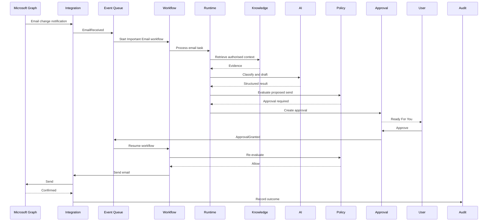
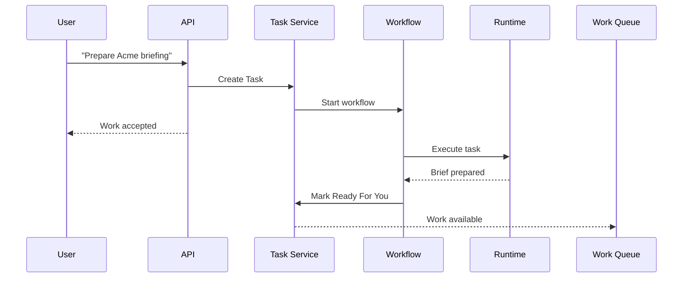

# 1. Purpose

This document defines the API and service interface model for the TeamMates Operating System (TMOS).

It establishes the contract between:

- customer-facing applications
- TeamMate Runtime
- workflow engine
- approval engine
- knowledge services
- memory services
- policy and permission services
- Microsoft 365 integration
- notification services
- billing
- audit
- future external integrations

The objective is to ensure TMOS behaves as a coherent platform rather than a collection of tightly coupled features.

# 2. API Design Principles

TMOS APIs should be:

- RESTful where practical
- event-driven where asynchronous behaviour is more appropriate
- tenant-aware
- versioned
- idempotent for controlled state-changing operations
- explicit about permissions
- auditable
- predictable
- consistent across modules

The API should expose business concepts rather than underlying infrastructure.

Prefer:

`POST /approvals/{id}/approve`

rather than:

`POST /workflow-engine/action-handler`

# 3. MVP Architecture Position

For the SME MVP, TMOS should be implemented as a modular application with clear service boundaries rather than a large microservices estate.

Logical service boundaries remain:

- Identity
- Organisation
- TeamMate Runtime
- Tasks
- Workflow
- Approvals
- Knowledge
- Memory
- Policy
- Permissions
- Integrations
- Notifications
- Audit
- Billing

These may initially run inside a shared backend deployment.

The interfaces defined in this document allow later separation without redesigning the product.

# 4. API Base Structure

Recommended public API structure:

`/api/v1/...`

Examples:

`GET /api/v1/teammates`

`GET /api/v1/work-queue`

Future breaking changes may use:

`/api/v2/...`

Non-breaking additions should not require a version change.

# 5. Internal Service Interfaces

Internal module/service interfaces should use a separate namespace.

Recommended:

`/internal/v1/...`

These interfaces are not public customer APIs.

Examples:

`POST /internal/v1/policy/evaluate`

`POST /internal/v1/runtime/execute`

# 6. Authentication

All protected API requests require an authenticated identity.

Initial authentication:

- Microsoft identity / Entra-compatible OAuth
- secure TMOS session

Future:

- Google identity
- enterprise SSO
- service identities
- partner API credentials

Authentication must be validated server-side.

# 7. Tenant Context

Every authenticated request resolves:

- user_id
- organisation_id
- workspace memberships
- effective user authority
- active subscription where relevant

The client must never establish tenant ownership merely by passing an organisation ID.

Tenant context is derived from authenticated membership.

# 8. Workspace Context

Where an endpoint operates within a workspace, the server must verify:

- workspace belongs to organisation
- user has appropriate workspace access
- TeamMate belongs to relevant workspace where applicable

Workspace IDs are selectors, not authority.

# 9. Common Response Format

Successful single-object response:

```json
{
  "data": {
    "id": "uuid",
    "type": "task",
    "attributes": {}
  }
}
```

Collection response:

```json
{
  "data": [],
  "meta": {
    "page": 1,
    "page_size": 25,
    "total": 120
  }
}
```

Exact response conventions may evolve but must remain consistent across the public API.

# 10. Error Response

Recommended structure:

```json
{
  "error": {
    "code": "APPROVAL_REQUIRED",
    "message": "This action requires human approval.",
    "request_id": "uuid",
    "details": {}
  }
}
```

Customer-facing messages should remain understandable.

Technical diagnostics may be available separately.

# 11. Standard Error Codes

Recommended common codes:

- UNAUTHENTICATED
- UNAUTHORISED
- TENANT_ACCESS_DENIED
- WORKSPACE_ACCESS_DENIED
- RESOURCE_NOT_FOUND
- INVALID_REQUEST
- VALIDATION_FAILED
- POLICY_DENIED
- APPROVAL_REQUIRED
- APPROVAL_EXPIRED
- INTEGRATION_UNAVAILABLE
- INTEGRATION_PERMISSION_MISSING
- KNOWLEDGE_ACCESS_DENIED
- CONFLICT
- IDEMPOTENCY_CONFLICT
- RATE_LIMITED
- INTERNAL_ERROR

# 12. Request Correlation

Every API request should have a request identifier.

Significant business workflows should also have a correlation identifier.

Recommended headers may include:

`X-Request-ID`

`X-Correlation-ID`

The server should generate these where clients do not.

# 13. Idempotency

Controlled state-changing endpoints should support idempotency where duplicate execution would be harmful.

Examples:

- email send
- meeting create
- workflow start
- checkout creation
- approval execution

Recommended header:

`Idempotency-Key`

Idempotency must be tenant-scoped.

# 14. Organisation API

## Get Current Organisation

`GET /api/v1/organisation`

Returns the active organisation.

## Update Organisation

`PATCH /api/v1/organisation`

Permitted fields may include:

- name
- industry
- employee_band
- timezone
- approved preferences

Requires appropriate organisation authority.

# 15. Current User API

## Get Current User

`GET /api/v1/me`

Returns:

- user profile
- organisation
- workspace memberships
- application role
- effective high-level permissions

Sensitive internal security data should not be exposed unnecessarily.

# 16. User API

## List Users

`GET /api/v1/users`

Potential filters:

- workspace
- status
- team
- department

## Get User

`GET /api/v1/users/{user_id}`

Returned data must be filtered according to customer access rights.

# 17. Workspace API

## List Workspaces

`GET /api/v1/workspaces`

## Create Workspace

`POST /api/v1/workspaces`

Example:

```json
{
  "name": "Operations",
  "workspace_type": "department"
}
```

## Get Workspace

`GET /api/v1/workspaces/{workspace_id}`

For the first SME release, workspace functionality may remain minimal.

# 18. TeamMate Catalogue API

## List Available Roles

`GET /api/v1/catalogue/roles`

Initial catalogue:

- Admin TeamMate

Future catalogue may include:

- Project TeamMate
- Finance TeamMate
- Sales TeamMate

The catalogue represents deployable product definitions, not customer TeamMate instances.

# 19. Get Role Definition

`GET /api/v1/catalogue/roles/{role_key}`

Returns customer-appropriate information such as:

- role name
- purpose
- supported capabilities
- current released version
- high-level permission requirements
- commercial eligibility

Do not expose internal prompt implementation through the catalogue.

# 20. Deploy TeamMate

`POST /api/v1/teammates`

Example:

```json
{
  "role_key": "ADMIN_TEAMMATE",
  "name": "Alex",
  "workspace_id": "uuid"
}
```

The service should:

1. resolve organisation
2. validate subscription entitlement
3. validate workspace
4. load released role Blueprint
5. apply TeamMate DNA reference
6. create deployed instance
7. initialise default Skill configuration
8. initialise permission template
9. enter configuring/probation lifecycle
10. record audit event

# 21. List TeamMates

`GET /api/v1/teammates`

Optional filters:

- status
- role
- workspace

# 22. Get TeamMate

`GET /api/v1/teammates/{teammate_id}`

Response may include:

- identity
- role
- status
- probation state
- capabilities
- current work summary
- integration health
- permission summary
- value summary

# 23. Update TeamMate

`PATCH /api/v1/teammates/{teammate_id}`

Customer-editable properties may include:

- display name
- working preferences
- approved communication settings
- notification configuration
- enabled optional capabilities

Protected fields must not be directly editable.

Examples:

- role version
- DNA version
- tenant
- restricted capabilities

# 24. Suspend TeamMate

`POST /api/v1/teammates/{teammate_id}/suspend`

Request:

```json
{
  "reason": "customer_paused"
}
```

Supported reasons are:

- `customer_paused`
- `trial_expired`
- `subscription_suspended`
- `security_suspension`
- `admin_suspended`

The service must authorise the caller or trusted platform source for the supplied reason, transition the TeamMate to `status = suspended`, store `suspension_reason`, set `suspended_at`, and record an audit event containing actor or source, reason and timestamp.

Suspension must prevent new active execution and new controlled external actions. Scheduled TeamMate work must stop where appropriate. Durable workflow and task state, configuration, required audit history and customer data subject to retention rules must be preserved.

Customer-facing Paused uses `reason = customer_paused`; Paused is not a separate domain state (D-001 / F-003).

# 25. Reactivate TeamMate

`POST /api/v1/teammates/{teammate_id}/activate`

Requires appropriate authority. Before changing status to `active`, the service must revalidate:

- subscription or entitlement
- required integrations and connection health
- effective permissions
- applicable policy
- TeamMate configuration

If any validation fails, the TeamMate remains `suspended`, no execution resumes, and the response identifies the failed validation without exposing sensitive control details. The attempt and outcome must be audited.

On success, the service sets `status = active`, clears `suspension_reason`, records the transition, and permits eligible scheduled and active work to resume through normal permission, policy and approval controls. Preserved workflows and tasks resume only according to their own valid state and recovery rules; reactivation does not imply that a controlled external action is approved.

# 26. Probation API

## Get Probation Status

`GET /api/v1/teammates/{teammate_id}/probation`

Returns:

- start date
- status
- completed trust/setup checks
- outstanding issues
- work statistics
- recommendation

## Complete Probation

`POST /api/v1/teammates/{teammate_id}/probation/complete`

Requires authorised human action.

Completing probation does not automatically grant additional permissions.

# 27. Permission API

## Get Effective TeamMate Permissions

`GET /api/v1/teammates/{teammate_id}/permissions`

Response should be understandable by the customer.

Example:

```json
{
  "permission_key": "email.send",
  "decision": "allow",
  "approval_required": true,
  "scope": {
    "mailbox": "primary"
  }
}
```

# 28. Update TeamMate Permission

`PUT /api/v1/teammates/{teammate_id}/permissions/{permission_key}`

Example:

```json
{
  "decision": "allow",
  "approval_required": true,
  "scope": {
    "mailbox": "primary"
  }
}
```

Server must validate:

- requesting user authority
- role restrictions
- platform restrictions
- valid scope

Every material permission change generates audit.

# 29. Policy API

Organisation administrators may require policy-management interfaces.

Initial MVP may expose only limited policy configuration.

Conceptual endpoints:

`GET /api/v1/policies`

`GET /api/v1/policies/{policy_id}`

`POST /api/v1/policies`

`PATCH /api/v1/policies/{policy_id}`

Policy mutation requires strong authorisation and audit.

# 30. Internal Policy Evaluation

Internal interface:

`POST /internal/v1/policy/evaluate`

Example:

```json
{
  "actor": {
    "type": "teammate",
    "id": "uuid"
  },
  "action": "email.send",
  "resource": {
    "type": "email",
    "recipient_type": "external"
  },
  "context": {
    "workflow_instance_id": "uuid"
  }
}
```

Response:

```json
{
  "decision": "approval_required",
  "policies": [
    "EXT_EMAIL_APPROVAL"
  ]
}
```

The frontend must never make the authoritative policy decision.

# 31. Task API

## List Tasks

`GET /api/v1/tasks`

Potential filters:

- teammate_id
- status
- priority
- due_before
- assigned_user_id
- workflow_instance_id

## Get Task

`GET /api/v1/tasks/{task_id}`

# 32. Delegate Work

`POST /api/v1/tasks`

Allows a human to delegate work to a TeamMate.

Example:

```json
{
  "teammate_id": "uuid",
  "title": "Prepare a briefing for tomorrow's Acme meeting",
  "instructions": "Include the latest customer correspondence and open actions.",
  "due_at": "2026-08-11T08:30:00Z"
}
```

The service must verify:

- TeamMate belongs to organisation
- work falls within permitted role/capability
- requesting user may delegate

# 33. Cancel Task

`POST /api/v1/tasks/{task_id}/cancel`

Cancellation must follow workflow safety rules.

Already completed external effects are not automatically reversible.

# 34. Work Queue API

The frontend should not need to reconstruct operational state from multiple low-level resources.

Provide:

`GET /api/v1/work-queue`

Response groups customer-facing work into:

- ready_for_you
- working
- needs_input
- completed

The endpoint may aggregate:

- tasks
- approvals
- workflow state
- integration issues requiring customer action

# 35. Needs Input API

Where a TeamMate requires missing information, the Task or Workflow should expose a structured input request.

Example:

`POST /api/v1/tasks/{task_id}/input`

```json
{
  "input_request_id": "uuid",
  "value": "17 August 2026"
}
```

The service resumes the existing workflow rather than creating unrelated new work.

# 36. Approval API

## List Approvals

`GET /api/v1/approvals`

Filters may include:

- status
- teammate_id
- priority
- workflow

## Get Approval

`GET /api/v1/approvals/{approval_id}`

Response should include:

- subject
- proposed action
- rationale
- impact
- evidence
- assumptions
- confidence where useful
- requested by
- expiry
- current status

# 37. Approve

`POST /api/v1/approvals/{approval_id}/approve`

Optional payload:

```json
{
  "comment": "Approved"
}
```

Approval creates an immutable Approval Action.

It should publish an ApprovalGranted event.

# 38. Reject

`POST /api/v1/approvals/{approval_id}/reject`

Example:

```json
{
  "reason": "The customer delivery date is incorrect."
}
```

Rejection must prevent the proposed action from executing.

# 39. Defer

`POST /api/v1/approvals/{approval_id}/defer`

Example:

```json
{
  "until": "2026-08-10T14:00:00Z"
}
```

# 40. Amend Before Approval

Where supported:

`POST /api/v1/approvals/{approval_id}/amend`

Example:

```json
{
  "amendment": {
    "body": "Updated email content"
  }
}
```

The system must preserve:

- original proposed action
- amendment
- final approved action

# 41. Approval Execution Rule

Approval does not itself execute an external action through the approval endpoint.

Recommended flow:

Approval decision

↓

ApprovalGranted event

↓

Workflow resumes

↓

Permission re-evaluation

↓

Policy re-evaluation

↓

External Skill executes

↓

Provider confirms

↓

Audit

This preserves workflow and control separation.

# 42. Daily Briefing API

## Get Latest Briefing

`GET /api/v1/teammates/{teammate_id}/briefings/latest`

## Generate Briefing

`POST /api/v1/teammates/{teammate_id}/briefings`

Manual generation may be permitted, but normal briefing generation should be scheduled.

Structured output should contain sections such as:

- priorities
- meetings
- important_email
- actions
- approvals
- prepared_work
- recommendations

The frontend owns presentation.

# 43. Conversation API

## List Conversations

`GET /api/v1/conversations`

## Create Conversation

`POST /api/v1/conversations`

## Get Messages

`GET /api/v1/conversations/{conversation_id}/messages`

## Send Message

`POST /api/v1/conversations/{conversation_id}/messages`

Example:

```json
{
  "content": "Prepare a summary of everything agreed with Acme this month."
}
```

Meaningful delegated work should create a Task or Workflow rather than exist only as a conversational response.

# 44. Knowledge Source API

## List Sources

`GET /api/v1/knowledge/sources`

## Add Source

`POST /api/v1/knowledge/sources`

Potential source types:

- SharePoint library
- OneDrive folder
- uploaded document

## Get Source

`GET /api/v1/knowledge/sources/{source_id}`

## Disconnect Source

`DELETE /api/v1/knowledge/sources/{source_id}`

Disconnection must prevent future authorised retrieval and trigger derived-index cleanup according to policy.

# 45. Knowledge Search

`POST /api/v1/knowledge/search`

Example:

```json
{
  "query": "What is our standard customer notice period?",
  "workspace_id": "uuid",
  "limit": 10
}
```

The server must enforce:

- tenant
- workspace
- source access
- classification
- TeamMate/user scope

before returning results.

# 46. Knowledge Search Response

Example:

```json
{
  "data": [
    {
      "document_id": "uuid",
      "title": "Customer Terms 2026",
      "excerpt": "...",
      "source": "SharePoint",
      "relevance": 0.91
    }
  ]
}
```

Relevance score is retrieval metadata, not necessarily customer-facing confidence.

# 47. Knowledge Retrieval Internal Interface

Internal Runtime interface should support:

- query
- organisation
- workspace
- TeamMate
- user context
- filters
- result limit

The Runtime should not call pgvector directly.

It calls the Knowledge module.

# 48. Memory API

Memory must not be exposed as unrestricted editable AI state.

Customer-facing governed interfaces should include:

## Pending Learning

`GET /api/v1/teammates/{teammate_id}/learning/pending`

## Confirm Learning

`POST /api/v1/learning/{memory_id}/confirm`

## Reject Learning

`POST /api/v1/learning/{memory_id}/reject`

## List Preferences

`GET /api/v1/teammates/{teammate_id}/preferences`

## Delete Preference

`DELETE /api/v1/teammates/{teammate_id}/preferences/{memory_id}`

# 49. Integration API

## List Connections

`GET /api/v1/integrations`

## Get Integration

`GET /api/v1/integrations/{integration_id}`

## Get Health

`GET /api/v1/integrations/{integration_id}/health`

Possible states:

- healthy
- degraded
- permissions_required
- disconnected
- error

# 50. Connect Microsoft 365

`POST /api/v1/integrations/microsoft/connect`

The response initiates an OAuth authorisation flow.

OAuth callbacks must be handled through secured provider-specific endpoints.

# 51. Disconnect Integration

`DELETE /api/v1/integrations/{integration_id}`

Expected behaviour:

1. authorise requesting user
2. stop new access
3. revoke credentials where supported
4. mark integration disconnected
5. pause dependent work
6. trigger derived-content cleanup
7. audit

# 52. Internal Connector Contract

TMOS should expose provider-independent connector interfaces.

Conceptual operations:

```text
mail.list
mail.get
mail.getThread
mail.send

calendar.list
calendar.get
calendar.create
calendar.update

contacts.search

files.search
files.get
```

Admin TeamMate invokes TMOS capabilities.

Provider adapters translate those capabilities into Microsoft Graph calls.

# 53. Mail Connector

Conceptual interface:

```text
MailConnector

listMessages()
getMessage()
getThread()
sendMessage()
```

The interface should use standard TMOS domain DTOs rather than Graph-native objects.

# 54. Calendar Connector

Conceptual interface:

```text
CalendarConnector

listEvents()
getEvent()
createEvent()
updateEvent()
```

Provider-specific metadata may be preserved separately.

# 55. File Connector

Conceptual interface:

```text
FileConnector

listSources()
search()
getMetadata()
getContent()
```

Access must remain constrained by customer-authorised scope.

# 56. Integration Webhooks

Inbound provider webhooks should:

1. authenticate/validate provider event
2. determine organisation/integration
3. persist external event
4. deduplicate
5. acknowledge provider promptly
6. process asynchronously

Do not execute long AI workflows synchronously inside webhook handling.

# 57. Internal Runtime Execute Interface

Conceptual endpoint:

`POST /internal/v1/runtime/execute`

Example:

```json
{
  "teammate_id": "uuid",
  "task_id": "uuid",
  "workflow_instance_id": "uuid",
  "objective": "Prepare a response to the customer email."
}
```

Runtime coordinates:

- role
- DNA
- permissions
- policy
- memory
- knowledge
- AI
- Skills
- workflow
- audit

# 58. Internal AI Interface

Conceptual interface:

```text
ReasoningService.execute(request)
```

Request should contain only required scoped context.

Response should return structured output.

The Runtime must not depend directly on provider-specific API formats.

# 59. Workflow API

## Start Workflow

`POST /api/v1/workflows/{workflow_key}/start`

Direct workflow initiation should only be exposed where there is a valid customer use case.

## Get Workflow Instance

`GET /api/v1/workflows/instances/{workflow_instance_id}`

## Cancel Workflow

`POST /api/v1/workflows/instances/{workflow_instance_id}/cancel`

Most customers interact with Tasks and Work Queue rather than raw workflow state.

# 60. Audit API

## Search Audit

`GET /api/v1/audit`

Potential filters:

- teammate
- user
- action
- object_type
- workflow
- date range

## Get Audit Event

`GET /api/v1/audit/{event_id}`

There should be no standard public endpoint to mutate an Audit Event.

# 61. Notification API

## List Notifications

`GET /api/v1/notifications`

## Mark Read

`POST /api/v1/notifications/{notification_id}/read`

## Preferences

`GET /api/v1/notification-preferences`

`PATCH /api/v1/notification-preferences`

Mandatory security/governance notifications may not be fully suppressible.

# 62. Value API

## Get Value Summary

`GET /api/v1/value`

Example:

```json
{
  "this_week": {
    "estimated_minutes_saved": 425,
    "tasks_completed": 48,
    "emails_prepared": 21,
    "meetings_prepared": 6
  }
}
```

The API must clearly distinguish estimated from measured value.

# 63. Subscription API

## Current Subscription

`GET /api/v1/subscription`

## Start Checkout

`POST /api/v1/subscription/checkout`

## Billing Portal

`POST /api/v1/subscription/portal`

Stripe remains the payment/billing provider.

TMOS interprets entitlement.

# 64. Event Architecture

Not every business interaction should be synchronous.

Important domain events include:

- OrganisationCreated
- TeamMateHired
- TeamMateProbationStarted
- TeamMateProbationCompleted
- IntegrationConnected
- IntegrationDisconnected
- EmailReceived
- MeetingUpcoming
- MeetingCompleted
- TaskCreated
- TaskCompleted
- ApprovalRequested
- ApprovalGranted
- ApprovalRejected
- KnowledgeSourceUpdated
- MemoryProposed
- MemoryConfirmed
- PolicyChanged
- WorkflowStarted
- WorkflowCompleted

# 65. Event Envelope

All domain events should follow a consistent envelope.

Example:

```json
{
  "event_id": "uuid",
  "event_type": "ApprovalGranted",
  "event_version": 1,
  "occurred_at": "2026-08-08T18:30:00Z",
  "organisation_id": "uuid",
  "workspace_id": "uuid",
  "actor": {
    "type": "user",
    "id": "uuid"
  },
  "correlation_id": "uuid",
  "causation_id": "uuid",
  "payload": {}
}
```

# 66. Correlation and Causation

Every multi-stage business journey should preserve:

`correlation_id`

Identifies the overall business flow.

`causation_id`

Identifies the event that directly caused another event.

Example:

EmailReceived

↓

TaskCreated

↓

DraftPrepared

↓

ApprovalRequested

↓

ApprovalGranted

↓

EmailSent

All events remain reconstructable as one flow.

# 67. Outbox Publication

Domain events requiring reliable publication should use the transactional outbox.

Application transaction:

- updates business state
- inserts event_outbox record
- commits

Publisher worker then sends the event to the queue.

The business transaction should not depend on synchronous queue availability.

# 68. Background Jobs

Recommended MVP background processing includes:

- email event processing
- calendar monitoring
- Daily Briefing generation
- workflow continuation
- knowledge indexing
- notification delivery
- approval expiry
- integration health
- memory consolidation

Background jobs must use durable state and idempotent processing.

# 69. Retry Behaviour

Transient failures may be retried.

Examples:

- provider timeout
- temporary queue error
- AI provider timeout

Do not automatically retry:

- permission denial
- policy denial
- invalid customer request
- permanent authentication failure

Retries must not duplicate external effects.

# 70. Rate Limits

Rate limits should exist where appropriate at:

- user
- organisation
- integration
- public API

Provider-side rate limiting should be handled through bounded retries and backoff.

Customer-facing errors should remain understandable.

# 71. Pagination

Collection endpoints should use a consistent pagination model.

For MVP, page-based pagination may be acceptable.

Future high-volume resources may use cursor pagination.

Do not mix pagination conventions unnecessarily.

# 72. Filtering

List endpoints should use explicit supported filters.

Do not expose unrestricted query execution against domain tables.

# 73. Sorting

Where supported, sorting should be limited to approved fields.

Example:

`created_at`

`due_at`

`priority`

Avoid arbitrary SQL-like client sorting expressions.

# 74. API Security Sequence

Every protected request should conceptually follow:

Authentication

↓

Tenant Resolution

↓

Resource Ownership

↓

User/TeamMate Authorisation

↓

Permission Evaluation where relevant

↓

Policy Evaluation where relevant

↓

Execution

↓

Audit

Controlled security decisions must not exist only in the UI.

# 75. Sensitive Data

API responses should minimise exposure of:

- OAuth tokens
- secrets
- raw credentials
- restricted document content
- unnecessary personal information
- unrestricted AI prompt context

Debugging fields must not bypass this principle.

# 76. Field-Level Redaction

Some API responses may require field-level redaction based on:

- role
- workspace
- data classification
- customer policy

The initial MVP may keep this limited, but the architecture should permit it.

# 77. Public vs Internal API

Public API:

- customer-facing web/mobile clients
- future approved customer integrations

Internal API/interfaces:

- TMOS modules
- workers
- runtime
- policy
- integration adapters

Internal interfaces must not be assumed safe solely because they are internal.

Authentication/authorisation appropriate to deployment architecture still applies.

# 78. OpenAPI

All public REST endpoints should be represented through OpenAPI.

OpenAPI becomes the contract for:

- frontend
- backend
- automated testing
- future SDK generation
- API documentation

Internal HTTP interfaces should also be documented where they are stable contracts.

# 79. Schema Reuse

Common OpenAPI components should define:

- IDs
- timestamps
- pagination
- errors
- user summaries
- TeamMate summaries
- source references

Avoid duplicating inconsistent schemas across endpoints.

# 80. API Evolution

Changes should be classified.

Non-Breaking

Examples:

- adding optional response property
- adding optional request field
- new endpoint

Breaking

Examples:

- removing field
- changing field semantics
- changing required payload structure
- changing response type

Breaking changes require controlled versioning or migration.

# 81. Deprecation

Deprecated endpoints or fields should have:

- deprecation notice
- migration path
- target removal version/date where practical

Do not silently change business semantics behind an existing API contract.

# 82. Observability

Every request should record appropriate metadata:

- request_id
- correlation_id
- route
- organisation_id internally
- status
- latency
- error classification

AI/runtime operations may additionally capture:

- model provider
- model
- prompt version
- workflow version
- latency
- usage/cost
- structured confidence

Sensitive business content should not be included unnecessarily.

# 83. API Audit

Not every GET request requires a business Audit Event.

Material actions should.

Examples:

- permission change
- TeamMate suspension
- approval
- external execution
- integration disconnect
- policy change

Operational access logging and business audit remain separate concepts.

# 84. Example Important Email Sequence

Include:



# 85. Example Direct Delegation Sequence



# 86. MVP Endpoint Priority

## Release 1 — Foundation

- `/me`
- `/organisation`
- `/workspaces`
- `/catalogue/roles`
- `/teammates`
- `/integrations`
- `/teammates/{id}/permissions`

## Release 2 — Trusted Work

- `/tasks`
- `/work-queue`
- `/approvals`
- `/briefings`
- `/conversations`

## Release 3 — Knowledge and Learning

- `/knowledge`
- `/learning`
- `/preferences`

## Release 4 — Governance and Commercial

- `/audit`
- `/value`
- `/subscription`
- expanded policy endpoints

# 87. API Anti-Patterns

Do not:

- expose database tables directly as the product API
- allow clients to set organisation authority
- allow frontend code to make policy decisions
- expose raw Graph objects throughout TMOS
- expose provider-specific AI interfaces to customer clients
- make chat the only way to create meaningful work
- execute controlled external actions synchronously before approval
- use undocumented production endpoints
- expose unrestricted debug data
- use one generic `/agent/run` endpoint for all business capability

# 88. Definition of Done

The API and service interface layer is sufficiently defined for controlled SME beta when:

1. Authentication and tenant context are consistently enforced.
2. TeamMate deployment has a defined contract.
3. Permissions can be read and changed safely.
4. Tasks represent delegated work.
5. Work Queue has a stable customer contract.
6. Approvals are first-class APIs.
7. Approval execution resumes workflows safely.
8. Microsoft connection and disconnection are defined.
9. Provider-neutral connector interfaces exist.
10. Knowledge search preserves permissions.
11. Governed learning APIs exist.
12. Runtime interface is provider independent.
13. Policy evaluation occurs server-side.
14. External actions can be idempotent.
15. Domain events use a standard envelope.
16. Correlation and causation are preserved.
17. Public APIs are representable in OpenAPI.
18. Audit mutation is prohibited through normal API.
19. Sensitive implementation details remain behind TMOS.
20. Core API flows are testable end to end.

# 89. Final API Principle

The API should expose what a digital colleague does.

Customers and applications interact with:

- TeamMates
- work
- approvals
- knowledge
- permissions
- results
- value

They should not need to interact directly with:

- prompts
- tokens
- embeddings
- context windows
- model-specific agent loops

Those are implementation concerns behind TMOS.

The service contract exists to preserve this separation as TeamMates grows.

# 90. Related Documents

- [TeamMates Product Requirements Document](../strategy/product-requirements.md)
- [TMOS Platform Architecture](../architecture/tmos-platform-architecture.md)
- [TMOS Domain Model](../architecture/tmos-domain-model.md)
- [TMOS System Architecture](../architecture/tmos-system-architecture.md)
- [TeamMate Interaction Model Specification](../architecture/teammate-interaction-model.md)
- [TMOS Security, Privacy & Governance Specification](../security/security-privacy-governance.md)
- [TMOS Data Model & Database Schema Specification](data-model-database-schema.md)
- [Engineering Release Plan](engineering-release-plan.md)
- [Test and Evaluation Specification](test-evaluation-specification.md)
- [Admin TeamMate Workflows](../product/admin-teammate-workflows.md)
