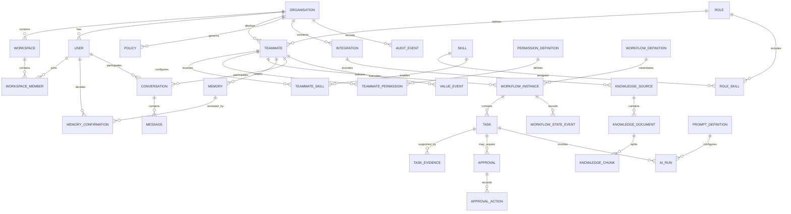

# 1. Purpose

This document translates the TMOS Domain Model into an implementation-ready relational data model for the TeamMates SME MVP.

The initial design assumes PostgreSQL as the primary transactional datastore.

The model must support:

- multi-tenancy
- organisations
- users
- workspaces
- TeamMates
- roles
- Skills
- workflows
- tasks
- approvals
- policies
- permissions
- memory
- knowledge
- integrations
- audit
- notifications
- subscriptions
- product-value measurement

The design must remain extensible for future TeamMate roles without requiring duplication of core platform structures.

# 2. Data Architecture Principles

The schema must be:

- tenant-safe
- auditable
- extensible
- version-aware
- API-friendly
- workflow-friendly
- AI-context friendly
- operationally simple for MVP
- suitable for future service extraction

The system should avoid premature distribution of transactional data across multiple databases.

# 3. System-of-Record Principle

TMOS does not automatically become the system of record for external business information.

Examples:

- Outlook remains system of record for email.
- Microsoft Calendar remains system of record for calendar events.
- SharePoint remains system of record for source documents.

TMOS is authoritative for:

- organisation configuration
- TeamMate identity
- TeamMate lifecycle
- role versions
- permissions
- policies
- workflow state
- tasks
- approvals
- governed memory
- audit
- TeamMate-specific learning
- subscription entitlement

External records should be referenced rather than unnecessarily duplicated.

# 4. Tenancy Model

Organisation is the primary tenant boundary.

All customer-scoped business records must either:

- contain `organisation_id` directly, or
- be provably related to an organisation through enforced relational ownership

For security-sensitive or frequently accessed tenant records, direct `organisation_id` is preferred.

Tenant protection should combine:

- authenticated organisation context
- application-level authorisation
- organisation-scoped queries
- foreign keys
- PostgreSQL Row Level Security where practical

# 5. Identifier Strategy

Use UUIDs for externally referenced primary keys.

Recommended:

`UUID`

for:

- organisations
- users
- workspaces
- TeamMates
- tasks
- workflows
- approvals
- audit events
- integrations
- knowledge objects

Internal high-volume implementation tables may use alternative identifiers later if justified.

Identifiers must never imply tenant authority.

# 6. Timestamp Standard

Use timezone-aware timestamps.

Recommended fields:

- created_at
- updated_at

where appropriate.

Additional lifecycle timestamps may include:

- activated_at
- suspended_at
- archived_at
- completed_at
- decided_at
- expires_at

Store timestamps consistently in UTC and localise in presentation.

# 7. Naming Conventions

Recommended:

- snake_case tables
- snake_case columns
- singular domain language in documentation
- plural table names in implementation

Examples:

`organisations`

`workflow_instances`

`approval_actions`

`knowledge_sources`

# 8. Organisation

Table:

`organisations`

Purpose:

Represents a customer tenant.

Core fields:

- id UUID PK
- name VARCHAR NOT NULL
- slug VARCHAR UNIQUE
- industry VARCHAR NULL
- employee_band VARCHAR NULL
- country_code VARCHAR
- timezone VARCHAR
- status VARCHAR NOT NULL
- configuration JSONB NULL
- created_at TIMESTAMPTZ NOT NULL
- updated_at TIMESTAMPTZ NOT NULL
- archived_at TIMESTAMPTZ NULL

Suggested status values:

- trial
- active
- suspended
- cancelled
- archived

# 9. Workspace

Table:

`workspaces`

Purpose:

Represents an operational area within an organisation.

Fields:

- id UUID PK
- organisation_id UUID FK NOT NULL
- name VARCHAR NOT NULL
- workspace_type VARCHAR NULL
- status VARCHAR NOT NULL
- configuration JSONB NULL
- created_at TIMESTAMPTZ NOT NULL
- updated_at TIMESTAMPTZ NOT NULL
- archived_at TIMESTAMPTZ NULL

For the SME MVP, one default workspace may be created automatically.

# 10. Users

Table:

`users`

Purpose:

Represents a human user.

Fields:

- id UUID PK
- organisation_id UUID FK NOT NULL
- external_identity_id VARCHAR NULL
- email VARCHAR NOT NULL
- display_name VARCHAR NOT NULL
- job_title VARCHAR NULL
- department VARCHAR NULL
- timezone VARCHAR NULL
- status VARCHAR NOT NULL
- preferences JSONB NULL
- created_at TIMESTAMPTZ NOT NULL
- updated_at TIMESTAMPTZ NOT NULL
- last_login_at TIMESTAMPTZ NULL

Recommended unique constraint:

`organisation_id, email`

# 11. Workspace Membership

Table:

`workspace_members`

Fields:

- id UUID PK
- organisation_id UUID FK NOT NULL
- workspace_id UUID FK NOT NULL
- user_id UUID FK NOT NULL
- membership_role VARCHAR NOT NULL
- status VARCHAR NOT NULL
- created_at TIMESTAMPTZ NOT NULL
- updated_at TIMESTAMPTZ NOT NULL

Suggested membership roles:

- owner
- admin
- manager
- member
- viewer

Unique constraint:

`workspace_id, user_id`

# 12. Teams

Table:

`teams`

Purpose:

Groups humans and TeamMates.

Fields:

- id UUID PK
- organisation_id UUID FK NOT NULL
- workspace_id UUID FK NULL
- name VARCHAR NOT NULL
- description TEXT NULL
- status VARCHAR NOT NULL
- created_at TIMESTAMPTZ NOT NULL
- updated_at TIMESTAMPTZ NOT NULL

# 13. Team Membership

Table:

`team_members`

Fields:

- id UUID PK
- organisation_id UUID FK NOT NULL
- team_id UUID FK NOT NULL
- member_type VARCHAR NOT NULL
- user_id UUID FK NULL
- teammate_id UUID FK NULL
- created_at TIMESTAMPTZ NOT NULL

Allowed member types:

- user
- teammate

Constraint:

Exactly one of `user_id` or `teammate_id` must be populated.

# 14. Role Definitions

Table:

`roles`

Purpose:

Defines platform-owned reusable TeamMate roles.

Fields:

- id UUID PK
- role_key VARCHAR NOT NULL
- name VARCHAR NOT NULL
- description TEXT NOT NULL
- version VARCHAR NOT NULL
- status VARCHAR NOT NULL
- role_definition JSONB NOT NULL
- created_at TIMESTAMPTZ NOT NULL
- updated_at TIMESTAMPTZ NOT NULL

Unique constraint:

`role_key, version`

Released role versions must not be silently overwritten.

# 15. TeamMate Instances

Table:

`teammates`

Purpose:

Represents a deployed customer-specific digital teammate.

Fields:

- id UUID PK
- organisation_id UUID FK NOT NULL
- workspace_id UUID FK NOT NULL
- role_id UUID FK NOT NULL
- name VARCHAR NOT NULL
- display_title VARCHAR NOT NULL
- status VARCHAR NOT NULL
- suspension_reason VARCHAR NULL
- probation_status VARCHAR NULL
- dna_version VARCHAR NOT NULL
- blueprint_version VARCHAR NOT NULL
- runtime_version VARCHAR NULL
- configuration JSONB NULL
- created_at TIMESTAMPTZ NOT NULL
- updated_at TIMESTAMPTZ NOT NULL
- activated_at TIMESTAMPTZ NULL
- suspended_at TIMESTAMPTZ NULL
- archived_at TIMESTAMPTZ NULL

Suggested status values:

- configuring
- probation
- active
- suspended
- archived

The deployed TeamMate status set is exactly `configuring`, `probation`, `active`, `suspended` and `archived` (D-001 / F-003). It does not include `draft`.

Supported `suspension_reason` values:

- customer_paused
- trial_expired
- subscription_suspended
- security_suspension
- admin_suspended

`suspension_reason` must be non-null when `status = suspended` and null for other statuses. Customer-facing Paused is stored as `status = suspended` with `suspension_reason = customer_paused`.

Suspension and reactivation transitions must be represented in the audit store. Reactivation clears `suspension_reason` only after relevant subscription or entitlement, integration, permission, policy and TeamMate configuration checks succeed.

# 16. Skill Definitions

Table:

`skills`

Purpose:

Defines reusable platform capabilities.

Fields:

- id UUID PK
- skill_key VARCHAR NOT NULL
- name VARCHAR NOT NULL
- description TEXT NOT NULL
- version VARCHAR NOT NULL
- execution_type VARCHAR NOT NULL
- configuration_schema JSONB NULL
- status VARCHAR NOT NULL
- created_at TIMESTAMPTZ NOT NULL
- updated_at TIMESTAMPTZ NOT NULL

Unique constraint:

`skill_key, version`

# 17. Role Skills

Table:

`role_skills`

Purpose:

Defines which Skills belong to a Role version.

Fields:

- id UUID PK
- role_id UUID FK NOT NULL
- skill_id UUID FK NOT NULL
- requirement_type VARCHAR NOT NULL
- default_configuration JSONB NULL
- created_at TIMESTAMPTZ NOT NULL

Suggested requirement types:

- required
- optional
- restricted

# 18. TeamMate Skills

Table:

`teammate_skills`

Purpose:

Customer-instance configuration for a Skill.

Fields:

- id UUID PK
- organisation_id UUID FK NOT NULL
- teammate_id UUID FK NOT NULL
- skill_id UUID FK NOT NULL
- enabled BOOLEAN NOT NULL
- configuration JSONB NULL
- created_at TIMESTAMPTZ NOT NULL
- updated_at TIMESTAMPTZ NOT NULL

# 19. Permission Definitions

Table:

`permission_definitions`

Purpose:

Defines reusable permission types.

Fields:

- id UUID PK
- permission_key VARCHAR UNIQUE NOT NULL
- name VARCHAR NOT NULL
- description TEXT
- resource_type VARCHAR NOT NULL
- action VARCHAR NOT NULL
- created_at TIMESTAMPTZ NOT NULL

Examples:

- email.read
- email.draft
- email.send
- calendar.read
- calendar.create
- calendar.update
- document.read
- document.share
- payment.execute

# 20. TeamMate Permissions

Table:

`teammate_permissions`

Fields:

- id UUID PK
- organisation_id UUID FK NOT NULL
- teammate_id UUID FK NOT NULL
- permission_definition_id UUID FK NOT NULL
- scope JSONB NOT NULL
- decision VARCHAR NOT NULL
- approval_required BOOLEAN NOT NULL DEFAULT FALSE
- granted_by_user_id UUID FK NULL
- expires_at TIMESTAMPTZ NULL
- created_at TIMESTAMPTZ NOT NULL
- updated_at TIMESTAMPTZ NOT NULL

Allowed decisions:

- allow
- deny

Explicit deny takes precedence over allow.

# 21. Policies

Table:

`policies`

Purpose:

Defines customer governance rules.

Fields:

- id UUID PK
- organisation_id UUID FK NOT NULL
- workspace_id UUID FK NULL
- name VARCHAR NOT NULL
- policy_type VARCHAR NOT NULL
- priority INTEGER NOT NULL
- rule_definition JSONB NOT NULL
- status VARCHAR NOT NULL
- version INTEGER NOT NULL
- created_by_user_id UUID FK NOT NULL
- created_at TIMESTAMPTZ NOT NULL
- updated_at TIMESTAMPTZ NOT NULL

Policies should be version-aware.

A historical action must remain traceable to the policy version evaluated at the time.

# 22. Workflow Definitions

Table:

`workflow_definitions`

Purpose:

Defines reusable versioned workflows.

Fields:

- id UUID PK
- workflow_key VARCHAR NOT NULL
- name VARCHAR NOT NULL
- role_id UUID FK NULL
- version VARCHAR NOT NULL
- definition JSONB NOT NULL
- status VARCHAR NOT NULL
- created_at TIMESTAMPTZ NOT NULL
- updated_at TIMESTAMPTZ NOT NULL

Unique constraint:

`workflow_key, version`

# 23. Workflow Instances

Table:

`workflow_instances`

Purpose:

Represents runtime execution of a workflow.

Fields:

- id UUID PK
- organisation_id UUID FK NOT NULL
- workspace_id UUID FK NOT NULL
- teammate_id UUID FK NULL
- workflow_definition_id UUID FK NOT NULL
- status VARCHAR NOT NULL
- trigger_type VARCHAR NOT NULL
- trigger_reference VARCHAR NULL
- trigger_payload JSONB NULL
- context JSONB NULL
- correlation_id UUID NOT NULL
- causation_id UUID NULL
- started_at TIMESTAMPTZ NOT NULL
- updated_at TIMESTAMPTZ NOT NULL
- completed_at TIMESTAMPTZ NULL
- failed_at TIMESTAMPTZ NULL

Suggested status values:

- queued
- running
- needs_input
- waiting_for_approval
- completed
- failed
- cancelled

# 24. Workflow State History

Table:

`workflow_state_events`

Purpose:

Provides append-only state-transition history.

Fields:

- id UUID PK
- organisation_id UUID FK NOT NULL
- workflow_instance_id UUID FK NOT NULL
- from_status VARCHAR NULL
- to_status VARCHAR NOT NULL
- reason VARCHAR NULL
- metadata JSONB NULL
- created_at TIMESTAMPTZ NOT NULL

This supports operational debugging and audit reconstruction.

# 25. Tasks

Table:

`tasks`

Purpose:

Represents meaningful units of work.

Fields:

- id UUID PK
- organisation_id UUID FK NOT NULL
- workspace_id UUID FK NOT NULL
- teammate_id UUID FK NULL
- assigned_user_id UUID FK NULL
- workflow_instance_id UUID FK NULL
- title VARCHAR NOT NULL
- description TEXT NULL
- task_type VARCHAR NOT NULL
- priority VARCHAR NOT NULL
- status VARCHAR NOT NULL
- due_at TIMESTAMPTZ NULL
- source_type VARCHAR NULL
- source_reference VARCHAR NULL
- confidence VARCHAR NULL
- metadata JSONB NULL
- created_at TIMESTAMPTZ NOT NULL
- updated_at TIMESTAMPTZ NOT NULL
- completed_at TIMESTAMPTZ NULL

Suggested statuses:

- proposed
- queued
- working
- needs_input
- awaiting_approval
- completed
- rejected
- cancelled
- failed

# 26. Task Evidence

Table:

`task_evidence`

Purpose:

Associates a task with supporting source information.

Fields:

- id UUID PK
- organisation_id UUID FK NOT NULL
- task_id UUID FK NOT NULL
- evidence_type VARCHAR NOT NULL
- source_reference VARCHAR NOT NULL
- title VARCHAR NULL
- metadata JSONB NULL
- created_at TIMESTAMPTZ NOT NULL

Where possible, store references rather than duplicating full source content.

# 27. Approvals

Table:

`approvals`

Purpose:

Represents a human decision required before work may continue.

Fields:

- id UUID PK
- organisation_id UUID FK NOT NULL
- workspace_id UUID FK NULL
- task_id UUID FK NULL
- workflow_instance_id UUID FK NULL
- requested_by_teammate_id UUID FK NULL
- approver_user_id UUID FK NOT NULL
- approval_type VARCHAR NOT NULL
- subject TEXT NOT NULL
- rationale TEXT NULL
- impact TEXT NULL
- evidence JSONB NULL
- proposed_action JSONB NOT NULL
- status VARCHAR NOT NULL
- requested_at TIMESTAMPTZ NOT NULL
- expires_at TIMESTAMPTZ NULL
- decided_at TIMESTAMPTZ NULL
- decision_reason TEXT NULL

Statuses:

- pending
- approved
- rejected
- deferred
- expired
- cancelled

# 28. Approval Actions

Table:

`approval_actions`

Purpose:

Append-only approval history.

Fields:

- id UUID PK
- organisation_id UUID FK NOT NULL
- approval_id UUID FK NOT NULL
- user_id UUID FK NOT NULL
- action VARCHAR NOT NULL
- comment TEXT NULL
- amended_payload JSONB NULL
- created_at TIMESTAMPTZ NOT NULL

Approval history must not be rewritten when the final decision changes.

# 29. Memory

Table:

`memories`

Purpose:

Stores governed persistent context.

Fields:

- id UUID PK
- organisation_id UUID FK NOT NULL
- workspace_id UUID FK NULL
- teammate_id UUID FK NULL
- user_id UUID FK NULL
- memory_type VARCHAR NOT NULL
- content TEXT NOT NULL
- structured_content JSONB NULL
- source_type VARCHAR NOT NULL
- source_reference VARCHAR NULL
- confidence VARCHAR NULL
- sensitivity VARCHAR NULL
- status VARCHAR NOT NULL
- learned_at TIMESTAMPTZ NOT NULL
- expires_at TIMESTAMPTZ NULL
- created_at TIMESTAMPTZ NOT NULL
- updated_at TIMESTAMPTZ NOT NULL

Memory types:

- organisation
- workspace
- teammate
- working
- personalisation

# 30. Memory Confirmation

Table:

`memory_confirmations`

Purpose:

Records user decisions regarding persistent learned behaviour.

Fields:

- id UUID PK
- organisation_id UUID FK NOT NULL
- memory_id UUID FK NOT NULL
- user_id UUID FK NOT NULL
- decision VARCHAR NOT NULL
- amendment JSONB NULL
- created_at TIMESTAMPTZ NOT NULL

Decisions:

- accepted
- rejected
- amended

# 31. Knowledge Sources

Table:

`knowledge_sources`

Purpose:

Represents approved sources available to TeamMate retrieval.

Fields:

- id UUID PK
- organisation_id UUID FK NOT NULL
- workspace_id UUID FK NULL
- integration_id UUID FK NULL
- source_type VARCHAR NOT NULL
- name VARCHAR NOT NULL
- external_reference VARCHAR NULL
- classification VARCHAR NULL
- status VARCHAR NOT NULL
- sync_status VARCHAR NOT NULL
- access_metadata JSONB NULL
- created_at TIMESTAMPTZ NOT NULL
- updated_at TIMESTAMPTZ NOT NULL
- last_synced_at TIMESTAMPTZ NULL
- disconnected_at TIMESTAMPTZ NULL

# 32. Knowledge Documents

Table:

`knowledge_documents`

Fields:

- id UUID PK
- organisation_id UUID FK NOT NULL
- knowledge_source_id UUID FK NOT NULL
- external_document_id VARCHAR NULL
- title VARCHAR NOT NULL
- mime_type VARCHAR NULL
- source_version VARCHAR NULL
- classification VARCHAR NULL
- checksum VARCHAR NULL
- metadata JSONB NULL
- status VARCHAR NOT NULL
- indexed_at TIMESTAMPTZ NULL
- created_at TIMESTAMPTZ NOT NULL
- updated_at TIMESTAMPTZ NOT NULL

# 33. Knowledge Chunks

Table:

`knowledge_chunks`

Purpose:

Semantic-retrieval units.

Fields:

- id UUID PK
- organisation_id UUID FK NOT NULL
- knowledge_document_id UUID FK NOT NULL
- sequence_number INTEGER NOT NULL
- content TEXT NOT NULL
- token_count INTEGER NULL
- access_metadata JSONB NOT NULL
- metadata JSONB NULL
- embedding VECTOR NULL
- created_at TIMESTAMPTZ NOT NULL

Unique constraint:

`knowledge_document_id, sequence_number`

Access metadata must remain available during retrieval.

# 34. Prompt Definitions

Table:

`prompt_definitions`

Purpose:

Stores versioned managed prompt assets.

Fields:

- id UUID PK
- prompt_key VARCHAR NOT NULL
- name VARCHAR NOT NULL
- purpose TEXT NOT NULL
- version VARCHAR NOT NULL
- template TEXT NOT NULL
- input_schema JSONB NULL
- output_schema JSONB NULL
- status VARCHAR NOT NULL
- created_at TIMESTAMPTZ NOT NULL
- updated_at TIMESTAMPTZ NOT NULL

Unique constraint:

`prompt_key, version`

Released versions must not be silently modified.

# 35. AI Runs

Table:

`ai_runs`

Purpose:

Captures model invocation metadata required for traceability, evaluation and cost management.

Fields:

- id UUID PK
- organisation_id UUID FK NOT NULL
- teammate_id UUID FK NULL
- task_id UUID FK NULL
- workflow_instance_id UUID FK NULL
- prompt_definition_id UUID FK NULL
- model_provider VARCHAR NOT NULL
- model_name VARCHAR NOT NULL
- prompt_version VARCHAR NULL
- input_token_count INTEGER NULL
- output_token_count INTEGER NULL
- latency_ms INTEGER NULL
- confidence VARCHAR NULL
- status VARCHAR NOT NULL
- metadata JSONB NULL
- created_at TIMESTAMPTZ NOT NULL

Do not store unrestricted chain-of-thought.

Avoid storing raw prompts containing unnecessary sensitive content.

# 36. Integrations

Table:

`integrations`

Purpose:

Represents a customer's connection to an external system.

Fields:

- id UUID PK
- organisation_id UUID FK NOT NULL
- integration_type VARCHAR NOT NULL
- provider VARCHAR NOT NULL
- display_name VARCHAR NOT NULL
- status VARCHAR NOT NULL
- granted_scopes JSONB NULL
- external_tenant_id VARCHAR NULL
- credentials_reference VARCHAR NULL
- connected_by_user_id UUID FK NOT NULL
- connected_at TIMESTAMPTZ NOT NULL
- updated_at TIMESTAMPTZ NOT NULL
- last_health_check_at TIMESTAMPTZ NULL
- disconnected_at TIMESTAMPTZ NULL

Raw secrets or tokens must not be stored directly in normal application columns.

# 37. Integration Events

Table:

`integration_events`

Purpose:

Persists inbound external events before asynchronous processing.

Fields:

- id UUID PK
- organisation_id UUID FK NOT NULL
- integration_id UUID FK NOT NULL
- event_type VARCHAR NOT NULL
- external_event_id VARCHAR NOT NULL
- payload JSONB NULL
- processing_status VARCHAR NOT NULL
- received_at TIMESTAMPTZ NOT NULL
- processed_at TIMESTAMPTZ NULL

Unique constraint:

`integration_id, external_event_id`

This provides duplicate-event protection.

# 38. Conversations

Table:

`conversations`

Purpose:

Represents a human-TeamMate interaction thread.

Fields:

- id UUID PK
- organisation_id UUID FK NOT NULL
- workspace_id UUID FK NOT NULL
- teammate_id UUID FK NOT NULL
- user_id UUID FK NOT NULL
- channel VARCHAR NOT NULL
- external_thread_reference VARCHAR NULL
- created_at TIMESTAMPTZ NOT NULL
- updated_at TIMESTAMPTZ NOT NULL

Conversation is not authoritative for work state.

# 39. Messages

Table:

`messages`

Fields:

- id UUID PK
- organisation_id UUID FK NOT NULL
- conversation_id UUID FK NOT NULL
- sender_type VARCHAR NOT NULL
- sender_user_id UUID FK NULL
- sender_teammate_id UUID FK NULL
- content TEXT NOT NULL
- metadata JSONB NULL
- created_at TIMESTAMPTZ NOT NULL

Allowed sender types:

- user
- teammate
- system

# 40. Notifications

Table:

`notifications`

Fields:

- id UUID PK
- organisation_id UUID FK NOT NULL
- user_id UUID FK NOT NULL
- teammate_id UUID FK NULL
- notification_type VARCHAR NOT NULL
- priority VARCHAR NOT NULL
- title VARCHAR NOT NULL
- body TEXT NOT NULL
- channel VARCHAR NOT NULL
- status VARCHAR NOT NULL
- related_object_type VARCHAR NULL
- related_object_id UUID NULL
- created_at TIMESTAMPTZ NOT NULL
- delivered_at TIMESTAMPTZ NULL
- read_at TIMESTAMPTZ NULL

# 41. Subscription

Table:

`subscriptions`

Purpose:

Represents commercial entitlement.

Fields:

- id UUID PK
- organisation_id UUID FK UNIQUE NOT NULL
- provider VARCHAR NOT NULL
- external_customer_id VARCHAR NULL
- external_subscription_id VARCHAR NULL
- plan_key VARCHAR NOT NULL
- status VARCHAR NOT NULL
- trial_ends_at TIMESTAMPTZ NULL
- current_period_start TIMESTAMPTZ NULL
- current_period_end TIMESTAMPTZ NULL
- created_at TIMESTAMPTZ NOT NULL
- updated_at TIMESTAMPTZ NOT NULL

# 42. Usage Events

Table:

`usage_events`

Purpose:

Tracks operational consumption for internal cost analysis and future commercial controls.

Fields:

- id UUID PK
- organisation_id UUID FK NOT NULL
- teammate_id UUID FK NULL
- event_type VARCHAR NOT NULL
- quantity NUMERIC NOT NULL
- unit VARCHAR NOT NULL
- metadata JSONB NULL
- occurred_at TIMESTAMPTZ NOT NULL

Examples:

- ai_input_tokens
- ai_output_tokens
- document_processed
- workflow_completed
- email_draft
- knowledge_query

These metrics should not dominate customer-facing pricing language.

# 43. Value Events

Table:

`value_events`

Purpose:

Tracks useful work and estimated customer value.

Fields:

- id UUID PK
- organisation_id UUID FK NOT NULL
- teammate_id UUID FK NOT NULL
- task_id UUID FK NULL
- workflow_instance_id UUID FK NULL
- value_type VARCHAR NOT NULL
- estimated_minutes_saved INTEGER NULL
- estimation_method VARCHAR NULL
- customer_adjusted_minutes INTEGER NULL
- metadata JSONB NULL
- created_at TIMESTAMPTZ NOT NULL

Examples:

- email_response_drafted
- meeting_brief_prepared
- action_managed
- document_created

# 44. Probation Events

Table:

`probation_events`

Purpose:

Tracks TeamMate trust and onboarding progression.

Fields:

- id UUID PK
- organisation_id UUID FK NOT NULL
- teammate_id UUID FK NOT NULL
- event_type VARCHAR NOT NULL
- description TEXT NULL
- metadata JSONB NULL
- created_at TIMESTAMPTZ NOT NULL

Examples:

- probation_started
- integration_validated
- permission_validated
- first_task_completed
- first_approval_completed
- learning_confirmed
- probation_extended
- probation_completed

# 45. Audit Events

Table:

`audit_events`

Purpose:

Immutable business traceability.

Fields:

- id UUID PK
- organisation_id UUID FK NOT NULL
- workspace_id UUID FK NULL
- actor_type VARCHAR NOT NULL
- actor_user_id UUID FK NULL
- actor_teammate_id UUID FK NULL
- event_type VARCHAR NOT NULL
- object_type VARCHAR NULL
- object_id UUID NULL
- action VARCHAR NOT NULL
- reason TEXT NULL
- evidence JSONB NULL
- metadata JSONB NULL
- correlation_id UUID NULL
- created_at TIMESTAMPTZ NOT NULL

Audit events are append-only.

No standard application endpoint should update or delete historical audit events.

# 46. Event Outbox

Table:

`event_outbox`

Purpose:

Supports reliable domain event publication.

Fields:

- id UUID PK
- organisation_id UUID FK NULL
- event_type VARCHAR NOT NULL
- event_version INTEGER NOT NULL
- aggregate_type VARCHAR NOT NULL
- aggregate_id UUID NULL
- correlation_id UUID NULL
- causation_id UUID NULL
- payload JSONB NOT NULL
- status VARCHAR NOT NULL
- created_at TIMESTAMPTZ NOT NULL
- published_at TIMESTAMPTZ NULL

The event outbox must be committed in the same database transaction as relevant business state.

# 47. Idempotency Records

Table:

`idempotency_keys`

Purpose:

Prevent duplicate controlled operations.

Fields:

- id UUID PK
- organisation_id UUID FK NOT NULL
- idempotency_key VARCHAR NOT NULL
- operation_type VARCHAR NOT NULL
- request_hash VARCHAR NULL
- result_reference VARCHAR NULL
- status VARCHAR NOT NULL
- created_at TIMESTAMPTZ NOT NULL
- expires_at TIMESTAMPTZ NULL

Unique constraint:

`organisation_id, idempotency_key`

# 48. Recommended Indexes

At minimum consider indexes for:

`users(organisation_id, email)`

`workspace_members(organisation_id, workspace_id, user_id)`

`teammates(organisation_id, status)`

`tasks(organisation_id, status)`

`tasks(teammate_id, status)`

`tasks(organisation_id, due_at)`

`workflow_instances(organisation_id, status)`

`workflow_instances(teammate_id, status)`

`approvals(organisation_id, status)`

`approvals(approver_user_id, status)`

`memories(organisation_id, memory_type)`

`knowledge_sources(organisation_id, status)`

`knowledge_documents(knowledge_source_id, status)`

`knowledge_chunks(knowledge_document_id, sequence_number)`

`integrations(organisation_id, status)`

`integration_events(integration_id, processing_status)`

`audit_events(organisation_id, created_at DESC)`

`notifications(user_id, status, created_at DESC)`

Exact indexing should be validated against real query patterns.

# 49. Vector Indexes

Use pgvector for MVP semantic retrieval.

Vector-index choice should be based on:

- dataset size
- query patterns
- latency
- accuracy

Do not prematurely optimise before representative customer data volumes exist.

# 50. Row Level Security

RLS should be used where practical on tenant-scoped tables.

Conceptual policy:

A row is accessible only where:

`organisation_id = current_organisation_context`

RLS must not rely on organisation IDs supplied directly by untrusted clients.

# 51. Platform-Owned Tables

Platform definition tables may be globally readable by authorised application services.

Examples:

- roles
- skills
- permission_definitions
- workflow_definitions
- prompt_definitions

They remain writable only through controlled platform administration and deployment processes.

# 52. Customer-Owned Runtime Tables

Customer-scoped runtime records include:

- teammates
- tasks
- workflow_instances
- approvals
- policies
- permissions
- memories
- knowledge_sources
- integrations
- notifications
- audit_events
- value_events

These must remain tenant isolated.

# 53. Immutable vs Mutable Data

Recommended append-only or immutable records include:

- audit_events
- approval_actions
- released role versions
- released Skill versions
- released workflow definitions
- released prompt versions
- workflow_state_events

Mutable operational records include:

- task current status
- TeamMate current status
- integration health
- workflow instance current state

Historical reconstruction should not depend solely on mutable current-state fields.

# 54. Soft Delete Strategy

Use soft deletion where:

- restoration may be required
- audit history must remain connected
- operational history has value

Typical fields:

- archived_at
- deleted_at
- status

Hard deletion may be required for:

- legally required deletion
- privacy deletion
- expired temporary data

Audit and legal obligations must be assessed before destructive deletion.

# 55. Versioning Strategy

Version independently:

- TeamMate DNA
- roles
- Skills
- workflows
- prompts
- policies where applicable

Runtime records should retain enough references to reconstruct which versions influenced behaviour.

# 56. JSONB Usage

JSONB is appropriate for:

- extensible configuration
- external metadata
- provider-specific metadata
- workflow context
- structured evidence

Do not use JSONB to avoid modelling stable relational concepts.

Core searchable and constrained business attributes should remain explicit columns.

# 57. Sensitive Data

Avoid storing:

- OAuth tokens in ordinary columns
- plaintext secrets
- unnecessary full email bodies
- unnecessary full document copies
- unrestricted model prompts containing customer content

Where content storage is required, apply appropriate classification and retention.

# 58. Encryption and Credential References

Integration records should use:

`credentials_reference`

or equivalent to point to protected secret storage.

Sensitive token material should be encrypted and access-controlled separately from normal domain records.

# 59. Knowledge Deletion

When a Knowledge Source is disconnected:

1. prevent new access immediately
2. mark source disconnected
3. stop dependent sync
4. remove or deactivate retrievable derived content according to policy
5. preserve required audit metadata

Disconnected content must not continue appearing in ordinary knowledge search.

# 60. Conversation Retention

Conversation history should have independent retention rules from:

- audit
- memory
- tasks
- workflow state

Deleting conversation history must not unintentionally erase required business audit records.

# 61. Audit Retention

Audit retention should be separately governed.

Do not encode an arbitrary long-term retention period as a universal rule before legal and customer requirements are confirmed.

The schema must support configurable retention and archival.

# 62. Database Migration Strategy

All schema changes must use version-controlled migrations.

Requirements:

- deterministic execution
- reviewed changes
- staging validation
- rollback or forward-fix plan
- migration observability
- no manual production schema drift

# 63. Migration Order

Initial migration sequence should broadly follow:

1. organisations
2. users
3. workspaces
4. workspace_members
5. roles
6. skills
7. teammates
8. permission_definitions
9. teammate_permissions
10. policies
11. workflow_definitions
12. workflow_instances
13. workflow_state_events
14. tasks
15. task_evidence
16. approvals
17. approval_actions
18. integrations
19. integration_events
20. knowledge_sources
21. knowledge_documents
22. knowledge_chunks
23. memories
24. memory_confirmations
25. conversations
26. messages
27. prompt_definitions
28. ai_runs
29. notifications
30. audit_events
31. event_outbox
32. idempotency_keys
33. subscriptions
34. usage_events
35. value_events
36. probation_events

Exact order may change based on implementation dependencies.

# 64. Seed Data

Initial platform seed data may include:

- Admin TeamMate role
- initial Skills
- permission definitions
- workflow definitions
- initial prompts
- default policy templates

Seed data must itself be version controlled.

# 65. Domain Relationship Overview

Include the following Mermaid diagram:

# 66. Database Boundary

The database should represent business truth and durable work state.

It should not become a dumping ground for:

- temporary model internals
- unrestricted chain-of-thought
- full copies of every connected business system
- raw provider logs
- transient frontend state

# 67. Performance Principle

Optimise schema design based on actual access patterns.

Likely high-frequency queries include:

- current Work Queue
- pending approvals
- active workflow state
- TeamMate permissions
- upcoming tasks
- relevant memories
- knowledge retrieval
- recent audit events

These should drive indexing and query optimisation.

# 68. Scaling Principle

The MVP should scale the PostgreSQL architecture before introducing unnecessary distributed persistence.

Potential future drivers for specialist stores include:

- very high semantic-search volume
- audit scale
- analytics scale
- event-streaming scale

These are evolution triggers, not MVP prerequisites.

# 69. Data Integrity Requirements

Database constraints should enforce important invariants where practical.

Examples:

- workspace belongs to organisation
- TeamMate belongs to organisation
- approval belongs to same organisation as task/workflow
- TeamMate permission belongs to same organisation
- exactly one team member type
- released definition versions remain unique
- external integration events remain idempotent

Do not rely exclusively on application code for relational integrity.

# 70. Multi-Tenant Test Requirements

Automated tests must verify Organisation A cannot:

- query Organisation B users
- retrieve Organisation B tasks
- access Organisation B approvals
- retrieve Organisation B knowledge
- retrieve Organisation B memory
- access Organisation B TeamMate
- inspect Organisation B audit
- reference Organisation B IDs to bypass tenancy

Tenant-isolation tests are release-blocking.

# 71. Definition of Done

The data model is sufficiently implemented for controlled SME beta when:

1. All core domain objects have explicit relational ownership.
2. Tenant-scoped records are organisation-bound.
3. RLS exists where appropriate.
4. Admin TeamMate can be represented as a versioned role and deployed instance.
5. Permissions can be explicitly enforced.
6. Policy versions can be traced.
7. Workflow state persists.
8. Work Queue states can be derived reliably.
9. Approvals preserve immutable decision history.
10. Memory is scoped and governable.
11. Knowledge retrieval retains access metadata.
12. AI execution metadata is traceable without storing hidden reasoning.
13. Integration events are idempotent.
14. External action idempotency can be supported.
15. Audit events are append-only.
16. Domain events can be published reliably through the outbox.
17. Customer value can be recorded.
18. Schema migrations are version controlled.
19. Released definitions cannot be silently overwritten.
20. Cross-tenant automated tests pass.

# 72. Final Data Principle

TMOS should store enough information to allow a TeamMate to:

- work reliably
- maintain governed context
- resume interrupted work
- respect permissions
- request authority
- explain outcomes
- preserve traceability

without unnecessarily duplicating customer systems of record.

The database is not the AI’s memory dump.

It is the governed operational state of the TeamMates platform.

# 73. Related Documents

- [TeamMates Product Requirements Document](../strategy/product-requirements.md)
- [TMOS Platform Architecture](../architecture/tmos-platform-architecture.md)
- [TMOS Domain Model](../architecture/tmos-domain-model.md)
- [TMOS System Architecture](../architecture/tmos-system-architecture.md)
- [TeamMate Factory](../architecture/teammate-factory.md)
- [TMOS Security, Privacy & Governance Specification](../security/security-privacy-governance.md)
- [API Contract and Service Interfaces](api-contract-service-interfaces.md)
- [Engineering Release Plan](engineering-release-plan.md)
- [Test and Evaluation Specification](test-evaluation-specification.md)
